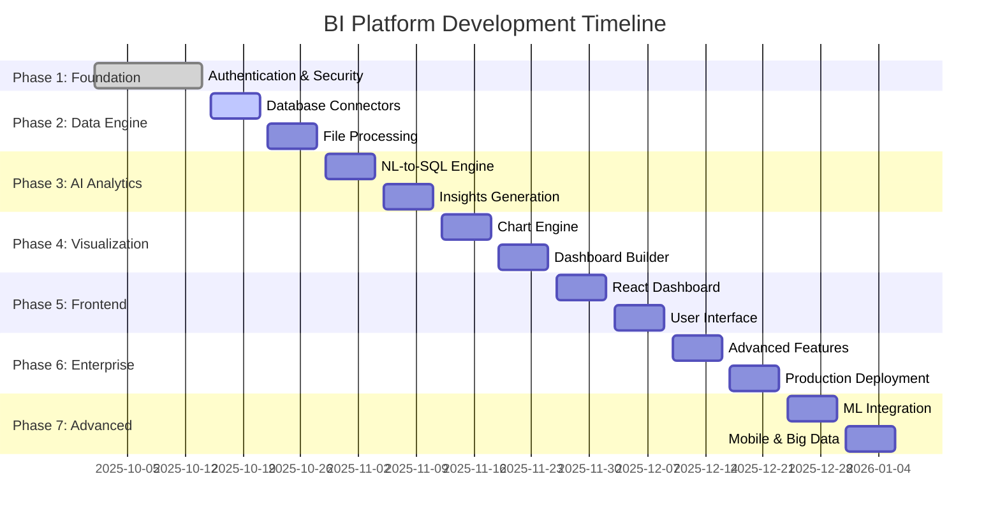

# Smart Business Intelligence Assistant - Project Plan

## Project Overview

Transform the existing Bee Agent Chat into a powerful Business Intelligence Assistant that allows users to ask questions about their business data in natural language and get insights with visualizations.

### **Why Python for BI? The Strategic Advantage**

**Python is the ideal choice for Business Intelligence platforms** due to its unmatched ecosystem:

#### **Data Science Supremacy**
- **pandas & numpy**: Industry-standard data manipulation and analysis
- **scikit-learn**: Comprehensive machine learning for predictive analytics
- **matplotlib & seaborn**: Professional statistical visualizations
- **plotly**: Interactive, publication-quality charts and dashboards

#### **AI/ML Integration Excellence**
- **LangChain**: Advanced LLM orchestration for natural language processing
- **transformers**: State-of-the-art NLP models for query understanding
- **spacy**: Production-ready NLP for text processing
- **Groq Python SDK**: Native integration with fastest AI inference

#### **Database Connectivity Champion**
- **SQLAlchemy**: Powerful, flexible ORM supporting all major databases
- **psycopg2, pymongo, pyodbc**: Robust, mature database drivers
- **Superior data type handling**: Native support for complex data structures

#### **Performance & Scalability**
- **FastAPI**: Among the fastest Python frameworks, rivaling Node.js
- **Async/await**: Native asynchronous programming for concurrent operations
- **Celery**: Distributed task queue for background processing
- **Redis integration**: Seamless caching and session management

### Current Foundation (Transitioning to Python)
- **Backend**: FastAPI + SQLAlchemy (replacing Express + TypeScript)
- **Real-time**: FastAPI WebSockets (replacing Socket.IO)
- **AI Framework**: LangChain + Groq Python SDK (enhanced capabilities)
- **Data Processing**: pandas + numpy (native data science stack)
- **Deployment**: Docker + Kubernetes (production-ready)

### Target Product
A comprehensive Business Intelligence platform like Power BI where users can:
- **Connect Multiple Data Sources**: PostgreSQL, MySQL, SQL Server, Oracle, CSV, Excel, APIs
- **Natural Language Queries**: Ask "What were my top products last month?" and get instant insights
- **Interactive Dashboards**: Drag-and-drop dashboard builder with real-time data
- **Advanced Visualizations**: Charts, graphs, heatmaps, geographic maps with drill-down capabilities
- **AI-Powered Insights**: Automated pattern detection, anomaly alerts, predictive analytics
- **Enterprise Features**: Scheduled reports, data exports, role-based access, collaboration tools
- **Real-time Analytics**: Live data streaming, automatic refresh, real-time alerts
- **Mobile Responsive**: Access dashboards and reports from any device

### Key Requirements
- **Enterprise Authentication**: Multi-factor authentication, device trust, role-based access
- **Multi-Source Data Integration**: Support for 10+ database types and file formats
- **Real-time Processing**: Live data streaming and instant query responses
- **AI-Powered Analytics**: Natural language to SQL, automated insights, predictive modeling
- **Interactive Visualizations**: 20+ chart types with drill-down and filtering
- **Dashboard Builder**: Drag-and-drop interface with real-time collaboration
- **Enterprise Deployment**: Microservices architecture, horizontal scaling, cloud-ready
- **Mobile-First Design**: Responsive dashboards accessible on all devices

---

## System Architecture

### Backend Architecture (Python Microservices)
```
┌─────────────────────────────────────────────────────────────────┐
│                     API Gateway & Load Balancer                │
│                    (FastAPI + Rate Limiting)                   │
├─────────────────────────────────────────────────────────────────┤
│                    Authentication Service                       │
│               (JWT + OAuth + 2FA + Device Trust)               │
│                     (FastAPI + SQLAlchemy)                     │
├─────────────────────────────────────────────────────────────────┤
│                        Core Services                           │
│  ┌───────────────┬───────────────┬───────────────┬──────────────┐
│  │   Data        │   Query       │  Analytics    │  Dashboard   │
│  │  Connector    │   Engine      │   Service     │   Service    │
│  │  (pandas+     │ (LangChain+   │ (scikit+      │ (plotly+     │
│  │  SQLAlchemy)  │   Groq+SQL)   │  pandas+AI)   │  FastAPI)    │
│  └───────────────┴───────────────┴───────────────┴──────────────┘
├─────────────────────────────────────────────────────────────────┤
│                       Data Processing Layer                     │
│  ┌───────────────┬───────────────┬───────────────┬──────────────┐
│  │   ETL/ELT     │   Stream      │   Cache       │   Export     │
│  │  (pandas+     │  Processing   │   Redis       │   Service    │
│  │   Celery)     │  (asyncio)    │ (redis-py)    │ (FastAPI)    │
│  └───────────────┴───────────────┴───────────────┴──────────────┘
├─────────────────────────────────────────────────────────────────┤
│                      Data Source Layer                         │
│  ┌───────────────┬───────────────┬───────────────┬──────────────┐
│  │  PostgreSQL   │    MySQL      │  SQL Server   │   Oracle     │
│  │  (psycopg2)   │ (mysql-conn)  │   (pyodbc)    │ (cx_Oracle)  │
│  │   MongoDB     │   Snowflake   │  BigQuery     │   Files      │
│  │  (pymongo)    │   (snowflake) │ (google-cloud)│  (pandas)    │
│  └───────────────┴───────────────┴───────────────┴──────────────┘
├─────────────────────────────────────────────────────────────────┤
│                       Storage & Queue                          │
│  ┌───────────────┬───────────────┬───────────────┬──────────────┐
│  │   User DB     │   Metadata    │   File        │   Message    │
│  │(PostgreSQL+   │     Store     │   Storage     │    Queue     │
│  │ SQLAlchemy)   │  (PostgreSQL) │   (S3/Local)  │  (Celery+    │
│  │               │               │               │   Redis)     │
│  └───────────────┴───────────────┴───────────────┴──────────────┘
└─────────────────────────────────────────────────────────────────┘
```

### Frontend Architecture (React/Next.js)
```
┌─────────────────────────────────────────────────────────────────┐
│              Progressive Web App (PWA) Frontend                 │
├─────────────────────────────────────────────────────────────────┤
│                    Authentication Module                        │
│  ┌───────────────┬───────────────┬───────────────┬──────────────┐
│  │   Register    │     Login     │      2FA      │   Profile    │
│  │     Page      │     Page      │  Verification │  Management  │
│  └───────────────┴───────────────┴───────────────┴──────────────┘
├─────────────────────────────────────────────────────────────────┤
│                      Main Application                          │
│  ┌───────────────┬───────────────┬───────────────┬──────────────┐
│  │   Dashboard   │  Data Sources │   Query       │   Reports    │
│  │    Builder    │   Manager     │  Interface    │   Gallery    │
│  └───────────────┴───────────────┴───────────────┴──────────────┘
├─────────────────────────────────────────────────────────────────┤
│                    Visualization Engine                        │
│  ┌───────────────┬───────────────┬───────────────┬──────────────┐
│  │   Chart       │    Table      │    Map        │   Custom     │
│  │ Components    │  Components   │  Components   │  Widgets     │
│  │  (D3.js)      │  (React Grid) │  (Mapbox)     │  (Pluggable) │
│  └───────────────┴───────────────┴───────────────┴──────────────┘
├─────────────────────────────────────────────────────────────────┤
│                      Core Services                             │
│  ┌───────────────┬───────────────┬───────────────┬──────────────┐
│  │   API Client  │  WebSocket    │   State       │    Theme     │
│  │   (Axios)     │ (Real-time)   │  Management   │   System     │
│  │               │               │   (Zustand)   │              │
│  └───────────────┴───────────────┴───────────────┴──────────────┘
├─────────────────────────────────────────────────────────────────┤
│                     Mobile & Desktop                           │
│  ┌───────────────┬───────────────┬───────────────┬──────────────┐
│  │   Responsive  │   Touch       │   Offline     │   Export     │
│  │     Design    │  Gestures     │    Mode       │   Features   │
│  └───────────────┴───────────────┴───────────────┴──────────────┘
└─────────────────────────────────────────────────────────────────┘
```

### Deployment Strategy
- **Backend Services**: Kubernetes cluster on AWS/GCP/Azure with auto-scaling
- **Frontend**: Vercel/Netlify with global CDN and edge computing
- **Databases**: 
  - Primary: PostgreSQL cluster with read replicas
  - Cache: Redis cluster for real-time data
  - Analytics: ClickHouse for OLAP queries
- **File Storage**: AWS S3/Google Cloud Storage with automatic backups
- **Monitoring**: Prometheus + Grafana + ELK stack for comprehensive monitoring
- **Security**: WAF, DDoS protection, end-to-end encryption

---

## Development Phases - Backend-First Focused Approach

## ⚠️ CURRENT BACKEND STATUS ANALYSIS

### What We Actually Have (REALISTIC ASSESSMENT):
- ✅ **FastAPI application structure** - Running successfully on port 8001
- ✅ **Modular backend architecture** - Clean `app/modules/auth/` structure
- ✅ **Database models** - Complete auth schema with all tables created
- ✅ **Auth API endpoints** - `/register`, `/login`, `/verify-registration`, `/verify-login`
- ✅ **JWT token system** - Working access/refresh token generation
- ✅ **API documentation** - Full Swagger docs showing all auth endpoints
- ✅ **Core infrastructure** - SQLAlchemy, Pydantic, error handling

### Critical Missing Components (BLOCKING ISSUES):
- ❌ **Email service integration** - OTP emails are logged, not sent (CRITICAL)
- ❌ **Complete auth flow testing** - End-to-end verification incomplete
- ❌ **Professional email templates** - Using basic logging placeholders
- ❌ **Production security hardening** - Rate limiting, account lockout need testing
- ❌ **Data source connections** - Not started yet
- ❌ **Query processing engine** - Not started yet
- ❌ **File upload processing** - Not started yet
- ❌ **Dashboard/visualization backend** - Not started yet

### Problem: **Authentication architecture is solid, but email delivery is missing** - Users can register but cannot complete email verification.

---

## � PHASE 1: Complete Authentication System (Week 1)

### Objective: Fix broken authentication and complete MFA system
### Duration: 3-4 days
### Priority: **CRITICAL** - Nothing else works without this

#### Day 1-2: OTP Verification System

**Critical Tasks:**
1. **Email Service Integration**
   ```python
   # app/services/email_service.py
   class EmailService:
       def send_registration_otp(self, email: str, otp: str, name: str):
           """Send OTP for email verification"""
       
       def send_login_otp(self, email: str, otp: str, name: str):
           """Send OTP for login verification"""
   ```

2. **OTP Generation & Management**
   ```python
   # app/services/otp_service.py
   class OTPService:
       def generate_otp(self, user_id: int, otp_type: str) -> str:
           """Generate 6-digit OTP with 10-minute expiry"""
       
       def verify_otp(self, user_id: int, otp: str, otp_type: str) -> bool:
           """Verify OTP and handle attempts/lockout"""
   ```

3. **Missing Authentication Endpoints**
   ```python
   # app/api/auth.py - ADD these endpoints
   @router.post("/verify-registration")
   @router.post("/verify-login") 
   @router.post("/resend-otp")
   ```

**Deliverables:**
- ✅ Working email OTP for registration verification
- ✅ Working email OTP for login verification  
- ✅ Complete authentication flow that actually works
- ✅ Professional email templates
- ✅ OTP rate limiting and security features

#### Day 3-4: Data Source Foundation

**Focus: Get basic data connectivity working**

1. **Database Connectors (Essential)**
   ```python
   # app/services/data_connector.py
   class DatabaseConnector:
       def connect_postgresql(self, config: dict) -> bool:
       def connect_mysql(self, config: dict) -> bool:
       def test_connection(self, source_id: int) -> bool:
       def get_schema(self, source_id: int) -> dict:
   ```

2. **File Upload Processing**
   ```python
   # app/services/file_processor.py  
   class FileProcessor:
       def process_csv(self, file_path: str) -> pd.DataFrame:
       def process_excel(self, file_path: str) -> pd.DataFrame:
       def infer_schema(self, df: pd.DataFrame) -> dict:
   ```

3. **Make Data Source Endpoints Functional**
   - Currently they are API stubs
   - Need actual database connections
   - File upload should store and process files

**Success Criteria:**
- Users can register → verify email → login successfully
- Users can connect to PostgreSQL/MySQL databases
- Users can upload CSV/Excel files and see data preview
- All authentication flows work end-to-end

---

## 🧠 PHASE 2: Query Processing Engine (Week 2)

### Objective: Natural language to SQL conversion and query execution
### Duration: 5-7 days

#### Day 1-3: NL-to-SQL Engine

**Core Implementation:**
```python
# app/services/query_processor.py
class QueryProcessor:
    def __init__(self):
        self.llm_client = groq.Client(api_key=settings.GROQ_API_KEY)
    
    def process_natural_language(self, query: str, schema: dict) -> dict:
        """Convert natural language to SQL using Groq/LLM"""
        prompt = self.build_sql_prompt(query, schema)
        sql_query = self.llm_client.generate_sql(prompt)
        return {
            "sql": sql_query,
            "explanation": "Generated SQL explanation",
            "confidence": 0.95
        }
    
    def execute_query(self, sql: str, data_source_id: int) -> pd.DataFrame:
        """Execute SQL query and return results"""
        
    def cache_results(self, query_hash: str, results: dict):
        """Cache query results for performance"""
```

**Key Features:**
- Groq integration for fast LLM inference
- Schema-aware SQL generation
- Query validation and sanitization
- Result caching system
- Error handling and fallbacks

#### Day 4-5: Query History and Management

**Implementation:**
```python
# app/api/queries.py - Make these endpoints functional
@router.post("/queries") # Execute natural language query
@router.get("/queries")  # Get query history  
@router.post("/queries/execute") # Execute raw SQL
@router.get("/queries/{id}/results") # Get cached results
```

**Features:**
- Query history tracking
- Favorite queries
- Query sharing
- Performance metrics

#### Day 6-7: Data Preview and Analysis

**Basic Analytics:**
```python
# app/services/data_analyzer.py
class DataAnalyzer:
    def basic_stats(self, df: pd.DataFrame) -> dict:
        """Generate basic statistics for dataset"""
    
    def detect_data_types(self, df: pd.DataFrame) -> dict:
        """Smart data type detection"""
    
    def suggest_visualizations(self, df: pd.DataFrame) -> list:
        """Suggest appropriate chart types"""
```

**Success Criteria:**
- Users can ask questions like "Show me sales by month"
- System generates and executes SQL queries
- Results are returned as structured data
- Query history is tracked and accessible

---

## 📊 PHASE 3: Visualization and Dashboard Backend (Week 3)

### Objective: Generate chart-ready data and dashboard management
### Duration: 5-7 days

#### Day 1-3: Chart Data Generation

**Core Service:**
```python
# app/services/chart_service.py
class ChartService:
    def generate_chart_data(self, df: pd.DataFrame, chart_type: str) -> dict:
        """Transform query results into chart-ready format"""
        
    def supported_chart_types(self) -> list:
        """Return available chart types based on data"""
        
    def auto_chart_suggestion(self, df: pd.DataFrame) -> dict:
        """AI-powered chart type suggestions"""
```

**Chart Types to Support:**
- Bar charts, line charts, pie charts
- Tables with sorting/filtering
- Basic metrics (KPIs)
- Time series charts

#### Day 4-5: Dashboard Management

**Implementation:**
```python
# app/api/dashboards.py - Make functional
@router.post("/dashboards")     # Create dashboard
@router.get("/dashboards")      # List dashboards
@router.put("/dashboards/{id}") # Update dashboard
@router.delete("/dashboards/{id}") # Delete dashboard
```

**Features:**
- Dashboard CRUD operations
- Widget management
- Layout persistence
- Dashboard sharing

#### Day 6-7: Real-time Data Updates

**WebSocket Integration:**
```python
# app/api/websocket.py
class DashboardWebSocket:
    async def connect(self, websocket: WebSocket, dashboard_id: int):
        """WebSocket connection for real-time updates"""
        
    async def send_data_update(self, dashboard_id: int, widget_id: int):
        """Push real-time data updates"""
```

**Success Criteria:**
- Query results can be visualized as charts
- Dashboards can be created and managed
- Basic real-time data updates work
- Dashboard layouts are persistent

---

## 🔐 PHASE 4: Security and Production Readiness (Week 4)

### Objective: Production security and deployment preparation  
### Duration: 3-5 days

#### Day 1-2: Security Hardening

**Enhanced Security:**
```python
# app/middleware/security.py
class SecurityMiddleware:
    def rate_limiting(self):
        """Implement rate limiting per user/IP"""
    
    def audit_logging(self):
        """Log all security events"""
        
    def input_validation(self):
        """Enhanced input sanitization"""
```

**Features:**
- Rate limiting per endpoint
- Audit logging for security events
- Input validation and sanitization
- SQL injection prevention
- XSS protection

#### Day 3-4: Performance Optimization

**Optimizations:**
- Database query optimization
- Result caching (Redis)
- Connection pooling
- Background task processing (Celery)
- File upload optimization

#### Day 5: Production Deployment

**Deployment:**
- Docker containerization
- Environment configuration
- Health checks and monitoring
- CI/CD pipeline setup
- Production database setup

**Success Criteria:**
- Backend is production-ready
- All security measures implemented
- Performance optimized for real usage
- Monitoring and logging in place

---

## 🎨 PHASE 5: Frontend Development (Weeks 5-6)

### Objective: Only start frontend after backend is 100% complete and tested
### Duration: 2 weeks  

**Note:** Frontend development only begins after backend is fully functional and tested. This ensures:
- No wasted frontend work due to backend changes
- Complete API specification is available
- Authentication flows are verified working
- Data flows are tested and optimized

#### Week 1: Core Frontend
- Authentication UI (registration, login, OTP verification)
- Data source connection interface
- Basic query interface

#### Week 2: Dashboard Interface  
- Dashboard builder
- Chart rendering
- Real-time updates

---

## 📋 IMMEDIATE ACTION PLAN

### This Week's Priority (Most Critical):

1. **Day 1: Fix Authentication (URGENT)**
   - Implement `/verify-registration` endpoint
   - Implement `/verify-login` endpoint  
   - Add email service integration
   - Test complete auth flow

2. **Day 2-3: Data Sources**
   - Make database connections work
   - Implement file upload processing
   - Test data source functionality

3. **Day 4-5: Basic Queries**
   - Implement NL-to-SQL conversion
   - Make query endpoints functional
   - Test query execution

**Success Metric:** By end of week, a user should be able to:
1. Register account → Verify email → Login successfully
2. Connect to database OR upload CSV file
3. Ask simple question and get SQL + results back

### Why This Approach:

✅ **Focus on working features** - No more API stubs  
✅ **Backend-first** - Complete backend before frontend  
✅ **Critical path** - Authentication blocks everything else  
✅ **Incremental testing** - Each phase builds on previous  
✅ **Real functionality** - No placeholder implementations

This plan eliminates the "fake completion" problem where we have API endpoints that don't actually work.
**This plan eliminates the "fake completion" problem where we have API endpoints that don't actually work.**

---

## 🚫 What We're NOT Doing (Avoiding Scope Creep)

### Removed from Current Plan:
- ❌ Advanced ML/AI features (Phase 6-7 postponed)
- ❌ Mobile apps (focus on web first)  
- ❌ Complex visualizations (start with basic charts)
- ❌ Enterprise features (LDAP, SSO, advanced permissions)
- ❌ Big data connectors (Snowflake, BigQuery - later)
- ❌ Real-time streaming (basic refresh first)
- ❌ Advanced analytics (focus on basic BI)
- ❌ Microservices architecture (monolith first)

### Focus Areas Only:
✅ **Working authentication with OTP**  
✅ **Basic database connections (PostgreSQL, MySQL)**  
✅ **Simple file upload (CSV, Excel)**  
✅ **Natural language to SQL**  
✅ **Basic charts (bar, line, table)**  
✅ **Simple dashboards**  
✅ **Core security features**

### Success Definition:
A working BI platform where users can:
1. **Register and login** (with email verification)
2. **Connect their database** OR **upload a file**  
3. **Ask questions** in natural language
4. **Get answers** as charts and tables
5. **Save results** in simple dashboards

**Everything else is scope creep until this works perfectly.**

### Objective: Build responsive React frontend with modern UX
### Duration: 2 weeks

#### Week 9: Core UI Components & Authentication

##### Deliverables

1. **Modern React/Next.js Application**
   ```jsx
   // Component structure
   src/
   ├── components/
   │   ├── auth/              # Authentication components
   │   ├── dashboard/         # Dashboard builder
   │   ├── visualizations/    # Chart components
   │   ├── data-sources/      # Data connection UI
   │   └── common/           # Shared components
   ├── pages/
   │   ├── login.tsx         # Authentication pages
   │   ├── dashboard.tsx     # Main dashboard
   │   ├── query.tsx         # Query interface
   │   └── admin.tsx         # Admin panel
   └── hooks/
       ├── useAuth.ts        # Authentication hook
       ├── useQuery.ts       # Query processing
       └── useWebSocket.ts   # Real-time updates
   ```

2. **Authentication Integration**
   - Login/Register forms with validation
   - Two-factor authentication UI
   - Device trust management
   - Session handling and token refresh

3. **Responsive Design System**
   - Tailwind CSS for styling
   - Mobile-first approach
   - Dark/light theme support
   - Accessibility compliance (WCAG 2.1)

#### Week 10: Data Interface & Dashboard Builder

##### Deliverables

1. **Natural Language Query Interface**
   ```jsx
   const QueryInterface = () => {
     const [query, setQuery] = useState('');
     const [results, setResults] = useState(null);
     
     const handleQuery = async () => {
       const response = await fetch('/api/query', {
         method: 'POST',
         headers: { 'Content-Type': 'application/json' },
         body: JSON.stringify({ query, dataSourceId })
       });
       
       const data = await response.json();
       setResults(data);
     };
     
     return (
       <div className="query-interface">
         <input 
           type="text" 
           placeholder="Ask a question about your data..."
           value={query}
           onChange={(e) => setQuery(e.target.value)}
         />
         <button onClick={handleQuery}>Ask</button>
         {results && <ResultsDisplay data={results} />}
       </div>
     );
   };
   ```

2. **Interactive Dashboard Builder**
   - Drag-and-drop chart placement
   - Real-time chart customization
   - Dashboard sharing and collaboration
   - Export and printing capabilities

3. **Data Source Management UI**
   - Connection wizard with validation
   - Schema browser and preview
   - Connection testing interface
   - File upload with progress tracking

**Success Criteria:**
- Fully responsive across all devices
- Intuitive natural language query interface
- Interactive dashboard builder
- Seamless authentication flow
- Real-time data updates

---

## 🚀 PHASE 6: Advanced Analytics & ML (Weeks 11-12)

### Objective: Implement machine learning and predictive analytics
### Duration: 2 weeks

#### Week 11: Statistical Analysis & Pattern Detection

##### Deliverables

1. **Advanced Analytics Engine**
   ```python
   # Machine learning integration
   from sklearn.cluster import KMeans
   from sklearn.linear_model import LinearRegression
   from sklearn.ensemble import IsolationForest
   
   class AdvancedAnalytics:
       def detect_patterns(self, df: pd.DataFrame) -> Dict[str, Any]:
           """Automatically detect patterns in data"""
           results = {}
           
           # Clustering analysis
           if len(df.select_dtypes(include=[np.number]).columns) >= 2:
               numeric_data = df.select_dtypes(include=[np.number])
               kmeans = KMeans(n_clusters=3)
               clusters = kmeans.fit_predict(numeric_data)
               results['clusters'] = clusters.tolist()
           
           # Trend analysis
           if 'date' in df.columns:
               results['trends'] = self.analyze_trends(df)
           
           # Anomaly detection
           results['anomalies'] = self.detect_anomalies(df)
           
           return results
       
       def predictive_analysis(self, df: pd.DataFrame, target_column: str):
           """Generate predictions based on historical data"""
           # Time series forecasting
           # Regression analysis
           # Classification models
           pass
   ```

2. **Automated Insights Generation**
   ```python
   class InsightGenerator:
       def generate_insights(self, df: pd.DataFrame) -> List[Insight]:
           insights = []
           
           # Statistical insights
           insights.extend(self.statistical_insights(df))
           
           # Trend insights
           insights.extend(self.trend_insights(df))
           
           # Correlation insights
           insights.extend(self.correlation_insights(df))
           
           return insights
   ```

3. **Real-time Monitoring & Alerts**
   - Threshold-based alerting
   - Anomaly detection notifications
   - Scheduled report generation
   - Email/SMS alert integration

#### Week 12: Predictive Modeling & Forecasting

##### Deliverables

1. **Time Series Forecasting**
   ```python
   # Using Prophet for time series forecasting
   from prophet import Prophet
   
   class ForecastingEngine:
       def generate_forecast(self, df: pd.DataFrame, periods: int = 30):
           model = Prophet()
           model.fit(df)
           
           future = model.make_future_dataframe(periods=periods)
           forecast = model.predict(future)
           
           return forecast
   ```

2. **Machine Learning Models**
   - Customer segmentation (K-Means clustering)
   - Sales prediction (Linear/Polynomial regression)
   - Churn prediction (Random Forest)
   - Demand forecasting (ARIMA/Prophet)

3. **Model Management & Deployment**
   - Model versioning and tracking
   - Performance monitoring
   - A/B testing framework
   - Model retraining pipelines

**Success Criteria:**
- Automated pattern detection in data
- Accurate predictive models (>80% accuracy)
- Real-time anomaly detection
- Scheduled insights and reports
- Model performance monitoring

---

## 🌐 PHASE 7: Enterprise Features & Deployment (Weeks 13-14)

### Objective: Production deployment with enterprise-grade features
### Duration: 2 weeks

#### Week 13: Performance Optimization & Scaling

##### Deliverables

1. **Performance Optimization**
   ```python
   # Caching strategy with Redis
   import redis
   from functools import wraps
   
   redis_client = redis.Redis(host='localhost', port=6379, decode_responses=True)
   
   def cache_query_result(expiration=3600):
       def decorator(func):
           @wraps(func)
           async def wrapper(*args, **kwargs):
               cache_key = f"query:{hash(str(args) + str(kwargs))}"
               cached_result = redis_client.get(cache_key)
               
               if cached_result:
                   return json.loads(cached_result)
               
               result = await func(*args, **kwargs)
               redis_client.setex(cache_key, expiration, json.dumps(result))
               return result
           return wrapper
       return decorator
   ```

2. **Horizontal Scaling Architecture**
   - Load balancer configuration
   - Database connection pooling
   - Microservices communication
   - Auto-scaling policies

3. **Security Hardening**
   - SQL injection prevention
   - Rate limiting per user/IP
   - Data encryption at rest and transit
   - Audit logging and compliance

#### Week 14: Production Deployment & Monitoring

##### Deliverables

1. **Docker & Kubernetes Deployment**
   ```yaml
   # kubernetes deployment
   apiVersion: apps/v1
   kind: Deployment
   metadata:
     name: bi-platform-backend
   spec:
     replicas: 3
     selector:
       matchLabels:
         app: bi-platform
     template:
       metadata:
         labels:
           app: bi-platform
       spec:
         containers:
         - name: backend
           image: bi-platform:latest
           ports:
           - containerPort: 8000
           env:
           - name: DATABASE_URL
             valueFrom:
               secretKeyRef:
                 name: db-secret
                 key: url
   ```

2. **Monitoring & Observability**
   - Application performance monitoring (APM)
   - Log aggregation and analysis
   - Health checks and uptime monitoring
   - Error tracking and alerting

3. **CI/CD Pipeline**
   - Automated testing (unit, integration, e2e)
   - Code quality checks (linting, security scans)
   - Automated deployment to staging/production
   - Database migration management

**Success Criteria:**
- 99.9% uptime with load balancing
- Response times under 500ms for queries
- Automated deployment pipeline
- Comprehensive monitoring and alerting
- Security compliance (SOC 2, GDPR ready)
   - MongoDB (pymongo)
   - Oracle (cx_Oracle)
   ```

2. **File Processing Engine**
   ```python
   # File format support with pandas
   - CSV (pandas.read_csv - up to 100MB)
   - Excel (pandas.read_excel - .xlsx, .xls)
   - JSON (pandas.read_json - structured data)
   - Parquet (pandas.read_parquet - big data)
   - Real-time streaming (FastAPI WebSockets)
   ```

3. **Data Connection APIs**
   ```python
   # FastAPI endpoints
   POST /api/connections/database     # Add database connection
   GET  /api/connections              # List all connections
   PUT  /api/connections/{id}/test    # Test connection health
   DELETE /api/connections/{id}       # Remove connection
   POST /api/data/upload              # Upload files (CSV/Excel)
   GET  /api/data/sources             # List all data sources
   ```

4. **Data Type Detection & Validation**
   - Automatic schema inference (pandas.DataFrame.dtypes)
   - Data type mapping (pandas dtype conversion)
   - Data quality checks (pandas.DataFrame.isnull())
   - Missing value detection (pandas data profiling)

#### Week 4: Data Query Interface & Caching

##### Deliverables

1. **Unified Query Interface**
   ```python
   # Query abstraction layer with SQLAlchemy
   - SQL query builder (SQLAlchemy Core)
   - NoSQL query translator (pymongo queries)
   - File data querying (pandas SQL-like operations)
   - Query optimization (pandas query optimization)
   ```

2. **Real-time Data Pipeline**
   ```python
   # Streaming and real-time features
   - WebSocket connections (FastAPI WebSockets)
   - Data refresh scheduling (Celery Beat)
   - Change detection (pandas diff operations)
   - Background data sync (Celery workers)
   ```

3. **Caching & Performance**
   ```python
   # Performance optimization
   - Redis caching layer (redis-py)
   - Query result caching (pandas + Redis)
   - Metadata caching (SQLAlchemy + Redis)
   - Connection pooling (SQLAlchemy Engine)
   ```

---

## 🧠 PHASE 3: AI Analytics Engine (Weeks 5-6)

### Objective: Implement natural language processing and AI-powered insights
### Duration: 2 weeks

#### Week 5: Natural Language to SQL

##### Deliverables

1. **NL-to-SQL Conversion Engine**
   ```python
   # AI-powered query generation with LangChain
   - Natural language understanding (LangChain)
   - SQL query generation (LangChain + Groq)
   - Query optimization (SQLAlchemy + pandas)
   - Context-aware building (LangChain Memory)
   ```

2. **AI Query Interface**
   ```python
   # FastAPI endpoints for AI queries
   POST /api/ai/query                 # Natural language query
   POST /api/ai/explain               # Explain data patterns
   GET  /api/ai/suggestions           # Get query suggestions
   POST /api/ai/insights              # Generate insights
   ```

3. **Conversation Context**
   ```python
   # Conversational BI features with LangChain
   - Query history and context (LangChain Memory)
   - Follow-up question handling (LangChain Chains)
   - Data exploration suggestions (AI recommendations)
   - User preference learning (ML personalization)
   ```

#### Week 6: Automated Insights & Recommendations

##### Deliverables

1. **Pattern Detection Engine**
   ```python
   # AI-powered analytics with scikit-learn
   - Trend detection (pandas + numpy)
   - Anomaly identification (scikit-learn)
   - Correlation analysis (pandas.corr())
   - Predictive modeling (scikit-learn ML)
   ```

2. **Insight Generation**
   ```python
   # Automated insights with pandas + AI
   - Key metrics identification (pandas.describe())
   - Performance alerts (threshold monitoring)
   - Data quality reports (pandas profiling)
   - Business KPI tracking (custom metrics)
   ```

3. **Recommendation System**
   ```python
   # Smart recommendations with ML
   - Chart type suggestions (rule-based + ML)
   - Data exploration paths (graph algorithms)
   - Optimization recommendations (performance analysis)
   - Best practice guidance (domain knowledge)
   ```

---

## 📊 PHASE 4: Visualization & Chart Engine (Weeks 7-8)

### Objective: Build comprehensive visualization and charting capabilities
### Duration: 2 weeks

#### Week 7: Core Chart Components

##### Deliverables

1. **Chart Library Integration**
   ```python
   # Python visualization ecosystem
   - plotly for interactive charts (plotly.py)
   - matplotlib for statistical plots
   - seaborn for advanced statistical visualization
   - FastAPI endpoints for chart generation
   ```

2. **Chart Types Support**
   ```python
   # Comprehensive chart support
   # Standard charts (plotly + matplotlib)
   - Bar, Line, Pie, Doughnut
   - Area, Scatter, Bubble
   - Histogram, Box plot
   - Heatmap, Treemap
   
   # Advanced charts (plotly + seaborn)
   - Gantt charts (plotly.timeline)
   - Sankey diagrams (plotly.sankey)
   - Geographic maps (plotly.geo)
   - Time series (plotly.timeseries)
   ```

3. **Interactive Features**
   ```python
   # Chart interactivity with plotly
   - Zoom and pan (plotly built-in)
   - Drill-down functionality (callback functions)
   - Cross-chart filtering (plotly dash)
   - Real-time updates (FastAPI WebSockets)
   ```

#### Week 8: Dashboard Builder

##### Deliverables

1. **Drag-and-Drop Dashboard**
   ```typescript
   // Dashboard builder features
   - Grid-based layout system
   - Component library
   - Resize and reposition
   - Template gallery
   ```

2. **Dashboard Management**
   ```
   POST /api/dashboards              # Create dashboard
   GET  /api/dashboards              # List dashboards
   PUT  /api/dashboards/:id          # Update dashboard
   DELETE /api/dashboards/:id        # Delete dashboard
   POST /api/dashboards/:id/share    # Share dashboard
   ```

3. **Real-time Updates**
   ```typescript
   // Live dashboard features
   - WebSocket connections
   - Auto-refresh intervals
   - Real-time data streaming
   - Performance monitoring
   ```

---

## 🎨 PHASE 5: Frontend Dashboard Interface (Weeks 9-10)

### Objective: Build the user-facing dashboard and visualization interface
### Duration: 2 weeks

#### Week 9: Dashboard UI Components

##### Deliverables

1. **React Dashboard Framework**
   ```typescript
   // Dashboard components
   - Grid layout system (react-grid-layout)
   - Chart wrapper components
   - Filter and control panels
   - Data table components
   ```

2. **Navigation & User Experience**
   ```typescript
   // UI/UX features
   - Sidebar navigation
   - Search and filtering
   - Responsive design
   - Dark/light themes
   ```

3. **Data Source Management UI**
   ```typescript
   // Connection management
   - Database connection wizard
   - File upload interface
   - Connection testing UI
   - Data preview components
   ```

#### Week 10: Advanced Dashboard Features

##### Deliverables

1. **Interactive Query Builder**
   ```typescript
   // Query interface
   - Visual query builder
   - SQL editor with syntax highlighting
   - Query history and favorites
   - Share and save queries
   ```

2. **Collaboration Features**
   ```typescript
   // Team collaboration
   - Dashboard sharing
   - Comments and annotations
   - Version history
   - Team workspaces
   ```

3. **Export & Reporting**
   ```typescript
   // Export features
   - PDF report generation
   - Excel export
   - Scheduled reports
   - Email notifications
   ```

---

## 🏢 PHASE 6: Enterprise Features (Weeks 11-12)

### Objective: Implement enterprise-grade features for production deployment
### Duration: 2 weeks

#### Week 11: Advanced Analytics & Performance

##### Deliverables

1. **Advanced Analytics**
   ```typescript
   // Enterprise analytics
   - Statistical analysis
   - Cohort analysis
   - Funnel analysis
   - A/B testing framework
   ```

2. **Performance Optimization**
   ```typescript
   // Performance features
   - Query optimization
   - Data virtualization
   - Lazy loading
   - Memory management
   ```

3. **Security & Compliance**
   ```typescript
   // Enterprise security
   - Role-based access control (RBAC)
   - Data masking and encryption
   - Audit logging
   - GDPR compliance features
   ```

#### Week 12: Production Deployment & Monitoring

##### Deliverables

1. **Production Infrastructure**
   ```yaml
   # Kubernetes deployment
   - Auto-scaling configuration
   - Load balancing setup
   - Database clustering
   - Redis caching cluster
   ```

2. **Monitoring & Observability**
   ```typescript
   // Monitoring stack
   - Application performance monitoring
   - Error tracking and alerting
   - Usage analytics
   - Health check endpoints
   ```

3. **Enterprise Integration**
   ```typescript
   // Integration features
   - SSO (SAML, OAuth)
   - API integrations
   - Webhook support
   - Custom branding
   ```

---

## 🚀 PHASE 7: Advanced BI Features (Weeks 13-14)

### Objective: Implement Power BI-like advanced features
### Duration: 2 weeks

#### Advanced Features

1. **Machine Learning Integration**
   ```typescript
   // ML capabilities
   - Predictive analytics
   - Anomaly detection
   - Clustering analysis
   - Time series forecasting
   ```

2. **Big Data Support**
   ```typescript
   // Scalability features
   - Data lake connections
   - Streaming analytics
   - Distributed processing
   - Cloud storage integration
   ```

3. **Mobile Application**
   ```typescript
   // Mobile features
   - React Native app
   - Offline mode
   - Push notifications
   - Touch-optimized charts
   ```  
   ├── Hash password
   ├── Create user (isVerified: false)
   ├── Generate 6-digit OTP
   ├── Send registration OTP email
   └── Return: { message: "OTP sent", email: "masked_email" }

2. POST /api/auth/verify-registration
   ├── Validate OTP (check expiry, attempts)
   ├── Mark user as verified (isVerified: true)
   ├── Mark OTP as used
   ├── Send welcome email with platform features
   ├── Generate initial JWT tokens
   └── Return: { tokens, user, message: "Welcome!" }
```

#### Login Flow:
```
1. POST /api/auth/login  
   ├── Validate email + password
   ├── Check account status (verified, active)
   ├── Check device trust (optional skip OTP)
   ├── Generate 6-digit login OTP
   ├── Send login OTP email
   └── Return: { message: "OTP sent", maskedEmail: "te***@example.com" }

2. POST /api/auth/verify-login
   ├── User submits: email + OTP + optional device trust
   ├── Validate login OTP
   ├── Mark OTP as used
   ├── Update last login timestamp
   ├── Generate device trust (if requested)
   ├── Generate JWT tokens
   └── Return: { tokens, user, trustDevice: boolean }
```

#### Security Features:
- **OTP Expiry**: 10 minutes maximum
- **Rate Limiting**: 3 OTP attempts, then 15-minute lockout
- **Device Trust**: Optional 30-day device memory
- **Account Types**: Business accounts always require login OTP
- **Audit Trail**: All authentication events logged
- **Failed Attempts**: Account lockout after 5 failed login attempts
   ```

5. **API Documentation Enhancement**
   - Swagger/OpenAPI 3.0 integration
   - Complete authentication endpoint documentation
   - Request/response schemas for all auth endpoints
   - Error handling documentation

### Week 2: Backend BI Infrastructure

#### Objectives
- Enhance existing backend with BI capabilities
- Implement protected routes with JWT authentication
- Add file upload functionality for authenticated users
---

## 📋 **Implementation Checklist by Phase**

### ⚠️ Phase 1: Authentication & Security (IN PROGRESS - 70% Complete)
- [x] ✅ **Modular backend architecture** - Clean auth module structure
- [x] ✅ **Database models** - All auth tables created and working
- [x] ✅ **JWT token system** - Access/refresh tokens generated
- [x] ✅ **API endpoints** - Auth routes defined and documented
- [x] ✅ **Core auth service** - Business logic implemented
- [ ] ❌ **Email service integration** - OTP emails are mocked, not sent
- [ ] ❌ **Complete auth flow** - End-to-end testing incomplete
- [ ] ❌ **Professional email templates** - Basic logging only
- [ ] ❌ **Rate limiting implementation** - Partially done
- [ ] ❌ **Production-ready security** - Needs testing and hardening

### 🎯 Phase 2: Data Connection Engine (NEXT - Weeks 3-4)
- [ ] Database connection manager (PostgreSQL, MySQL, SQL Server)
- [ ] File upload system (CSV, Excel, JSON)
- [ ] Data type detection and validation
- [ ] Unified query interface
- [ ] Real-time data pipeline
- [ ] Caching layer with Redis
- [ ] Connection health monitoring

### 🧠 Phase 3: AI Analytics Engine (Weeks 5-6)
- [ ] Natural language to SQL conversion
- [ ] AI query interface
- [ ] Conversation context management
- [ ] Pattern detection engine
- [ ] Insight generation system
- [ ] Recommendation engine

### 📊 Phase 4: Visualization & Chart Engine (Weeks 7-8)
- [ ] Chart library integration (D3.js, Chart.js)
- [ ] 15+ chart types support
- [ ] Interactive features (zoom, drill-down)
- [ ] Drag-and-drop dashboard builder
- [ ] Real-time chart updates
- [ ] Dashboard management system

### 🎨 Phase 5: Frontend Dashboard Interface (Weeks 9-10)
- [ ] React dashboard framework
- [ ] Navigation and UX components
- [ ] Data source management UI
- [ ] Interactive query builder
- [ ] Collaboration features
- [ ] Export and reporting

### 🏢 Phase 6: Enterprise Features (Weeks 11-12)
- [ ] Advanced analytics (cohort, funnel)
- [ ] Performance optimization
- [ ] Role-based access control
- [ ] Production deployment infrastructure
- [ ] Monitoring and observability
- [ ] Enterprise integrations (SSO)

### 🚀 Phase 7: Advanced BI Features (Weeks 13-14)
- [ ] Machine learning integration
- [ ] Big data support
- [ ] Mobile application
- [ ] Advanced enterprise features

---

## 🛠️ **Technology Stack**

### **Backend Technologies (Python-First)**
| Technology | Purpose | Version |
|------------|---------|---------|
| **Python** | Runtime Language | 3.11+ |
| **FastAPI** | Web Framework | 0.104+ |
| **SQLAlchemy** | Database ORM | 2.0+ |
| **Alembic** | Database Migrations | 1.12+ |
| **PostgreSQL** | Primary Database | 15+ |
| **Redis** | Caching & Background Jobs | 7.0+ |
| **Celery** | Async Task Queue | 5.3+ |
| **WebSockets** | Real-time Communication | Built-in |
| **Pydantic** | Data Validation | 2.4+ |

### **Data Science & AI Stack**
| Technology | Purpose | Version |
|------------|---------|---------|
| **pandas** | Data Manipulation | 2.1+ |
| **numpy** | Numerical Computing | 1.24+ |
| **LangChain** | LLM Orchestration | 0.0.330+ |
| **Groq Python SDK** | AI/ML Processing | Latest |
| **scikit-learn** | Machine Learning | 1.3+ |
| **plotly** | Interactive Visualizations | 5.17+ |
| **matplotlib** | Statistical Plotting | 3.7+ |
| **seaborn** | Statistical Visualization | 0.12+ |

### **Database Connectors**
| Technology | Purpose | Version |
|------------|---------|---------|
| **psycopg2** | PostgreSQL Driver | 2.9+ |
| **pymongo** | MongoDB Driver | 4.5+ |
| **pyodbc** | SQL Server Driver | 4.0+ |
| **mysql-connector** | MySQL Driver | 8.1+ |
| **cx_Oracle** | Oracle Driver | 8.3+ |
| **sqlite3** | SQLite (Built-in) | Native |

### **Frontend Technologies**
| Technology | Purpose | Version |
|------------|---------|---------|
| **React** | UI Framework | 18+ |
| **Next.js** | Full-stack Framework | 14+ |
| **TypeScript** | Language | 5.0+ |
| **Tailwind CSS** | Styling | 3.3+ |
| **Plotly.js** | Interactive Charts | 2.26+ |
| **D3.js** | Custom Visualizations | 7.8+ |
| **Zustand** | State Management | 4.4+ |
| **React Query** | Data Fetching | 5.0+ |

### **DevOps & Infrastructure**
| Technology | Purpose | Version |
|------------|---------|---------|
| **Docker** | Containerization | Latest |
| **Kubernetes** | Orchestration | 1.28+ |
| **AWS/GCP** | Cloud Platform | Latest |
| **Terraform** | Infrastructure | 1.5+ |
| **GitHub Actions** | CI/CD | Latest |
| **Prometheus** | Monitoring | Latest |

---

## **Python Backend Project Structure**

```
smart-bi-platform/
├── backend/                        # Python FastAPI Backend
│   ├── app/
│   │   ├── __init__.py
│   │   ├── main.py                 # FastAPI application entry
│   │   ├── config/
│   │   │   ├── __init__.py
│   │   │   ├── settings.py         # Environment configuration
│   │   │   ├── database.py         # Database connection setup
│   │   │   └── redis_config.py     # Redis configuration
│   │   ├── models/
│   │   │   ├── __init__.py
│   │   │   ├── user.py             # SQLAlchemy User model
│   │   │   ├── data_source.py      # Data source models
│   │   │   ├── dashboard.py        # Dashboard configuration
│   │   │   └── query.py            # Query execution models
│   │   ├── api/
│   │   │   ├── __init__.py
│   │   │   ├── auth.py             # Authentication endpoints
│   │   │   ├── data.py             # Data management endpoints
│   │   │   ├── analytics.py        # AI analytics endpoints
│   │   │   └── dashboards.py       # Dashboard endpoints
│   │   ├── services/
│   │   │   ├── __init__.py
│   │   │   ├── auth_service.py     # Authentication logic
│   │   │   ├── data_connector.py   # Database connections
│   │   │   ├── ai_service.py       # LangChain + Groq integration
│   │   │   ├── chart_service.py    # Plotly chart generation
│   │   │   └── email_service.py    # Email notifications
│   │   ├── core/
│   │   │   ├── __init__.py
│   │   │   ├── security.py         # JWT & password hashing
│   │   │   ├── dependencies.py     # FastAPI dependencies
│   │   │   └── middleware.py       # Custom middleware
│   │   ├── utils/
│   │   │   ├── __init__.py
│   │   │   ├── data_processing.py  # Pandas data operations
│   │   │   ├── sql_generator.py    # NL-to-SQL conversion
│   │   │   └── validators.py       # Pydantic validators
│   │   ├── tasks/
│   │   │   ├── __init__.py
│   │   │   ├── celery_app.py       # Celery configuration
│   │   │   ├── data_tasks.py       # Background data processing
│   │   │   └── email_tasks.py      # Async email sending
│   │   └── tests/
│   │       ├── __init__.py
│   │       ├── test_auth.py        # Authentication tests
│   │       ├── test_data.py        # Data processing tests
│   │       └── test_analytics.py   # AI analytics tests
│   ├── alembic/                    # Database migrations
│   │   ├── versions/
│   │   ├── env.py
│   │   └── alembic.ini
│   ├── requirements.txt            # Python dependencies
│   ├── pyproject.toml             # Project configuration
│   ├── Dockerfile                 # Docker configuration
│   └── docker-compose.yml         # Local development setup
├── frontend/                       # Next.js React Frontend
│   ├── components/
│   │   ├── auth/                   # Authentication components
│   │   ├── charts/                 # Chart visualization components  
│   │   ├── dashboard/              # Dashboard builder components
│   │   └── common/                 # Reusable UI components
│   ├── pages/
│   │   ├── auth/                   # Authentication pages
│   │   ├── dashboard/              # Dashboard management
│   │   ├── data/                   # Data source management
│   │   └── api/                    # Next.js API routes
│   └── services/                   # Frontend API services
├── docs/                          # Documentation
├── kubernetes/                    # K8s deployment configs
└── scripts/                       # Build and deployment scripts
```

---

## 📈 **Success Metrics & KPIs**

### **Technical Metrics**
- **API Response Time**: < 200ms for queries, < 2s for complex analytics
- **Chart Generation**: < 3 seconds for interactive visualizations
- **Data Processing**: Handle 1M+ rows with sub-second response
- **Uptime**: 99.9% availability
- **Security**: Zero vulnerabilities in production

### **User Experience Metrics**
- **Time to Insight**: < 30 seconds from question to visualization
- **Query Success Rate**: > 95% successful natural language queries
- **Dashboard Load Time**: < 2 seconds
- **Mobile Performance**: Full functionality on mobile devices
- **User Satisfaction**: > 4.5/5 rating

### **Business Metrics**
- **Data Source Integrations**: 10+ supported databases
- **Chart Types**: 20+ visualization options
- **User Adoption**: 100+ active users by month 3
- **Enterprise Features**: Role-based access, SSO, compliance
- **Scalability**: Support for 10,000+ concurrent users

---

## 🎯 **Competitive Advantage**

### **vs Power BI**
- ✅ **Natural Language First**: Conversational queries as primary interface
- ✅ **AI-Powered Insights**: Automated pattern detection and recommendations
- ✅ **Developer-Friendly**: Open API, extensible architecture
- ✅ **Cost-Effective**: Transparent pricing, no vendor lock-in

### **vs Tableau**
- ✅ **Ease of Use**: No training required, natural language interface
- ✅ **Real-time Analytics**: Built-in streaming data support
- ✅ **Mobile-First**: Progressive web app with offline capabilities
- ✅ **Customizable**: White-label solutions for enterprises

### **vs Looker**
- ✅ **Self-Service**: Business users can create insights without IT
- ✅ **AI Integration**: Groq LLaMA for advanced natural language processing
- ✅ **Multi-Cloud**: Deploy on any cloud platform
- ✅ **Open Source Core**: Extensible and customizable

---

## 🛣️ **Development Roadmap Timeline**



---

## 🎉 **Phase Completion Rewards**

### **Milestone Celebrations**
- **Phase 1** ✅: 🎉 Authentication system launch party!
- **Phase 2**: 🚀 First data connection celebration
- **Phase 3**: 🧠 AI query demo day
- **Phase 4**: 📊 Visualization showcase
- **Phase 5**: 🎨 Dashboard design contest
- **Phase 6**: 🏢 Enterprise launch event
- **Phase 7**: 🌟 Full platform celebration!

---

**Ready to revolutionize Business Intelligence! 🚀**
**Next Phase: Data Connection Engine - Let's build the data foundation!**
   - Helpful tooltips and guides

2. **Performance Optimization**
   - Code splitting and lazy loading
   - Image optimization
   - Bundle size optimization

3. **Testing & Quality**
   - Component testing
   - E2E testing setup
   - Accessibility improvements

#### 🛠️ **Technical Tasks**
- [ ] Add smooth animations and micro-interactions
- [ ] Implement code splitting for better performance
- [ ] Create comprehensive component tests
- [ ] Add E2E testing with Playwright/Cypress
- [ ] Accessibility audit and improvements
- [ ] Performance optimization and monitoring

---

## **PHASE 3: Integration & Deployment (Week 7)**

### **Week 7: Full Integration & Production Deployment**
#### 🎯 **Objectives**
- Complete frontend-backend integration
- Production deployment
- Performance monitoring
- User acceptance testing

#### 📦 **Deliverables**
1. **Full System Integration**
   - Seamless frontend-backend communication
   - Error handling across the stack
   - Performance optimization

2. **Production Deployment**
   - Updated deployment configurations
   - Environment-specific optimizations
   - Monitoring and logging setup

3. **Quality Assurance**
   - End-to-end testing
   - Performance benchmarking
   - Security audit

#### 🛠️ **Technical Tasks**
- [ ] Complete frontend-backend integration testing
- [ ] Update deployment scripts for full-stack application
- [ ] Implement comprehensive monitoring
- [ ] Conduct security audit
- [ ] Performance optimization and testing
- [ ] User acceptance testing and feedback collection

---

## 🛠️ **Technology Stack**

### **Backend Technologies**
| Technology | Purpose | Version |
|------------|---------|---------|
| **Node.js** | Runtime | 18+ |
| **Express** | Web Framework | 4.18+ |
| **TypeScript** | Type Safety | 5.3+ |
| **Socket.IO** | Real-time Communication | 4.7+ |
| **Swagger** | API Documentation | 3.0+ |
| **Multer** | File Upload | 1.4+ |
| **Chart.js** | Chart Generation | 4.4+ |
| **MySQL2** | Database Driver | 3.6+ |
| **Redis** | Caching | 4.6+ |
| **Jest** | Testing | 29+ |

### **Frontend Technologies**
| Technology | Purpose | Version |
|------------|---------|---------|
| **Next.js** | React Framework | 14+ |
| **React** | UI Library | 18+ |
| **TypeScript** | Type Safety | 5.3+ |
| **Tailwind CSS** | Styling | 3.3+ |
| **Chart.js** | Data Visualization | 4.4+ |
| **Socket.IO Client** | Real-time Updates | 4.7+ |
| **Axios** | HTTP Client | 1.6+ |
| **React Hook Form** | Form Management | 7.47+ |

---

## 🗂️ **Project Structure**

### **Backend Structure**
```
src/
├── config/
│   ├── database.ts
│   ├── swagger.ts
│   └── redis.ts
├── controllers/
│   ├── ChatController.ts
│   ├── DataController.ts
│   └── AnalyticsController.ts
├── services/
│   ├── BeeAgentService.ts
│   ├── DataService.ts
│   ├── ChartService.ts
│   └── DatabaseService.ts
├── tools/
│   ├── CSVAnalyzerTool.ts
│   ├── ChartGeneratorTool.ts
│   ├── DatabaseConnectorTool.ts
│   └── InsightsGeneratorTool.ts
├── middleware/
│   ├── auth.ts
│   ├── upload.ts
│   └── validation.ts
├── types/
│   ├── BITypes.ts
│   ├── ChartTypes.ts
│   └── APITypes.ts
├── utils/
│   ├── dataProcessing.ts
│   ├── chartGeneration.ts
│   └── sqlGenerator.ts
├── routes/
│   ├── api.ts
│   ├── chat.ts
│   └── data.ts
├── tests/
│   ├── unit/
│   ├── integration/
│   └── e2e/
├── uploads/
└── server.ts
```

### **Frontend Structure**
```
frontend/
├── components/
│   ├── common/
│   │   ├── Button.tsx
│   │   ├── Input.tsx
│   │   └── Modal.tsx
│   ├── charts/
│   │   ├── BarChart.tsx
│   │   ├── LineChart.tsx
│   │   └── PieChart.tsx
│   ├── dashboard/
│   │   ├── DashboardGrid.tsx
│   │   ├── Widget.tsx
│   │   └── Sidebar.tsx
│   ├── data/
│   │   ├── FileUpload.tsx
│   │   ├── DataTable.tsx
│   │   └── DataSources.tsx
│   └── chat/
│       ├── ChatInterface.tsx
│       ├── MessageList.tsx
│       └── ChatInput.tsx
├── pages/
│   ├── dashboard/
│   │   ├── index.tsx
│   │   └── [id].tsx
│   ├── chat/
│   │   └── index.tsx
│   ├── data/
│   │   ├── upload.tsx
│   │   └── sources.tsx
│   ├── api/
│   │   └── auth.ts
│   ├── _app.tsx
│   └── index.tsx
├── services/
│   ├── api.ts
│   ├── socket.ts
│   └── auth.ts
├── hooks/
│   ├── useApi.ts
│   ├── useSocket.ts
│   └── useChart.ts
├── types/
│   ├── api.ts
│   ├── chart.ts
│   └── dashboard.ts
├── utils/
│   ├── chartHelpers.ts
│   ├── dataFormatters.ts
│   └── constants.ts
├── styles/
│   └── globals.css
└── tests/
    ├── components/
    ├── pages/
    └── e2e/
```

---

## 📊 **API Design**

### **Core Endpoints**
```yaml
# Chat & AI
POST /api/chat/message          # Send message to AI agent
GET  /api/chat/history         # Get chat history
POST /api/chat/clear           # Clear chat memory

# Data Management
POST /api/data/upload          # Upload CSV/Excel files
GET  /api/data/sources         # List data sources
POST /api/data/connect         # Connect to database
GET  /api/data/preview         # Preview data
POST /api/data/query           # Execute data query

# Analytics & Charts
POST /api/analytics/analyze    # Analyze data
POST /api/charts/generate      # Generate chart
GET  /api/charts/types         # Get available chart types
POST /api/insights/generate    # Generate insights

# Dashboard
GET  /api/dashboard/widgets    # Get dashboard widgets
POST /api/dashboard/save       # Save dashboard configuration
GET  /api/reports/list         # List saved reports
POST /api/reports/schedule     # Schedule automated reports
```

### **WebSocket Events**
```typescript
// Client to Server
'chat_message'     // Send chat message
'data_query'       // Execute data query
'chart_request'    // Request chart generation

// Server to Client
'agent_typing'     // AI is processing
'agent_update'     // Processing step update
'agent_response'   // Final AI response
'chart_generated'  // Chart ready
'data_processed'   // Data analysis complete
'error'           // Error occurred
```

---

## 🧪 **Testing Strategy**

### **Backend Testing**
- **Unit Tests**: All services and tools (90%+ coverage)
- **Integration Tests**: API endpoints and database operations
- **Performance Tests**: Load testing for data processing
- **Security Tests**: Input validation and authentication

### **Frontend Testing**
- **Component Tests**: React Testing Library
- **E2E Tests**: Playwright for user workflows
- **Visual Tests**: Storybook for component documentation
- **Accessibility Tests**: WAVE and axe-core

---

## 🚀 **Deployment Strategy**

### **Development Environment**
- Local development with hot reload
- Docker Compose for full stack
- Separate frontend and backend ports

### **Staging Environment**
- Render deployment with staging branch
- Full feature testing
- Performance monitoring

### **Production Environment**
- Render for both frontend and backend
- CDN for static assets
- Database hosting (PlanetScale/Railway)
- Redis hosting for caching

---

## 📈 **Success Metrics**

### **Technical Metrics**
- API response time < 200ms
- Chart generation < 2 seconds
- 99.9% uptime
- Zero security vulnerabilities

### **User Experience Metrics**
- Time to first insight < 30 seconds
- Query success rate > 95%
- User satisfaction score > 4.5/5
- Feature adoption rate > 80%

### **Business Metrics**
- 10+ pilot users by end of Phase 1
- 50+ users by end of Phase 2
- $5K+ MRR by month 3
- 90%+ customer retention rate

---

## 🔄 **Risk Mitigation**

### **Technical Risks**
| Risk | Impact | Mitigation |
|------|--------|------------|
| AI query accuracy | High | Extensive testing, fallback options |
| Performance issues | Medium | Caching, optimization, monitoring |
| Security vulnerabilities | High | Regular audits, input validation |
| Data corruption | High | Backups, validation, recovery procedures |

### **Business Risks**
| Risk | Impact | Mitigation |
|------|--------|------------|
| Market competition | Medium | Unique conversational approach, fast iteration |
| User adoption | High | Early user feedback, iterative development |
| Technical complexity | Medium | Phased approach, MVP focus |
| Resource constraints | Medium | Clear priorities, scope management |

---

## 💡 **Future Enhancements**

---

## 📋 SUMMARY

**We have a comprehensive restructured plan that focuses on:**

1. **Backend-First Approach** - Complete all backend functionality before starting frontend
2. **Critical Path Focus** - Fix authentication blocking issues first
3. **Real Implementation** - No more API stubs, everything must actually work
4. **Incremental Testing** - Each phase builds and tests on the previous
5. **Scope Control** - Removed unnecessary features, focused on core BI functionality

**Current Status:** Backend structure exists but authentication is broken and most endpoints are non-functional stubs.

**Next Steps:** Start with Day 1 - Fix OTP verification endpoints to make authentication work end-to-end.

**Success Definition:** A working BI platform where users can register→verify→login→connect data→ask questions→get visualized answers.