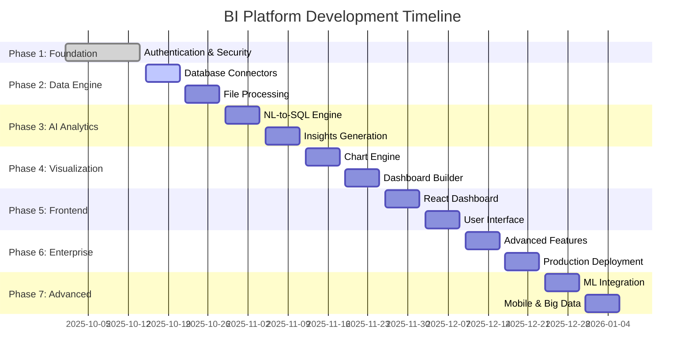

# Smart Business Intelligence Assistant - Project Plan

## Project Overview

Transform the existing Bee Agent Chat into a powerful Business Intelligence Assistant that allows users to ask questions about their business data in natural language and get insights with visualizations.

### Current Foundation
- Express + TypeScript backend
- Socket.IO real-time communication
- Bee Agent Framework with Groq LLaMA 3.1
- Production-ready deployment setup
- Security implementation (helmet, rate limiting, input validation)

### Target Product
A comprehensive Business Intelligence platform like Power BI where users can:
- **Connect Multiple Data Sources**: PostgreSQL, MySQL, SQL Server, Oracle, CSV, Excel, APIs
- **Natural Language Queries**: Ask "What were my top products last month?" and get instant insights
- **Interactive Dashboards**: Drag-and-drop dashboard builder with real-time data
- **Advanced Visualizations**: Charts, graphs, heatmaps, geographic maps with drill-down capabilities
- **AI-Powered Insights**: Automated pattern detection, anomaly alerts, predictive analytics
- **Enterprise Features**: Scheduled reports, data exports, role-based access, collaboration tools
- **Real-time Analytics**: Live data streaming, automatic refresh, real-time alerts
- **Mobile Responsive**: Access dashboards and reports from any device

### Key Requirements
- **Enterprise Authentication**: Multi-factor authentication, device trust, role-based access
- **Multi-Source Data Integration**: Support for 10+ database types and file formats
- **Real-time Processing**: Live data streaming and instant query responses
- **AI-Powered Analytics**: Natural language to SQL, automated insights, predictive modeling
- **Interactive Visualizations**: 20+ chart types with drill-down and filtering
- **Dashboard Builder**: Drag-and-drop interface with real-time collaboration
- **Enterprise Deployment**: Microservices architecture, horizontal scaling, cloud-ready
- **Mobile-First Design**: Responsive dashboards accessible on all devices

---

## System Architecture

### Backend Architecture (Microservices)
```
┌─────────────────────────────────────────────────────────────────┐
│                     API Gateway & Load Balancer                │
│                    (Express + Rate Limiting)                   │
├─────────────────────────────────────────────────────────────────┤
│                    Authentication Service                       │
│             (JWT + OAuth + 2FA + Device Trust)                 │
├─────────────────────────────────────────────────────────────────┤
│                        Core Services                           │
│  ┌───────────────┬───────────────┬───────────────┬──────────────┐
│  │   Data        │   Query       │  Analytics    │  Dashboard   │
│  │  Connector    │   Engine      │   Service     │   Service    │
│  │   Service     │   (AI+SQL)    │  (AI Insights)│ (Real-time)  │
│  └───────────────┴───────────────┴───────────────┴──────────────┘
├─────────────────────────────────────────────────────────────────┤
│                       Data Processing Layer                     │
│  ┌───────────────┬───────────────┬───────────────┬──────────────┐
│  │   ETL/ELT     │   Stream      │   Cache       │   Export     │
│  │   Pipeline    │  Processing   │   Redis       │   Service    │
│  └───────────────┴───────────────┴───────────────┴──────────────┘
├─────────────────────────────────────────────────────────────────┤
│                      Data Source Layer                         │
│  ┌───────────────┬───────────────┬───────────────┬──────────────┐
│  │  PostgreSQL   │    MySQL      │  SQL Server   │   Oracle     │
│  │   MongoDB     │   Snowflake   │  BigQuery     │   Files      │
│  └───────────────┴───────────────┴───────────────┴──────────────┘
├─────────────────────────────────────────────────────────────────┤
│                       Storage & Queue                          │
│  ┌───────────────┬───────────────┬───────────────┬──────────────┐
│  │   User DB     │   Metadata    │   File        │   Message    │
│  │ (PostgreSQL)  │     Store     │   Storage     │    Queue     │
│  └───────────────┴───────────────┴───────────────┴──────────────┘
└─────────────────────────────────────────────────────────────────┘
```

### Frontend Architecture (React/Next.js)
```
┌─────────────────────────────────────────────────────────────────┐
│              Progressive Web App (PWA) Frontend                 │
├─────────────────────────────────────────────────────────────────┤
│                    Authentication Module                        │
│  ┌───────────────┬───────────────┬───────────────┬──────────────┐
│  │   Register    │     Login     │      2FA      │   Profile    │
│  │     Page      │     Page      │  Verification │  Management  │
│  └───────────────┴───────────────┴───────────────┴──────────────┘
├─────────────────────────────────────────────────────────────────┤
│                      Main Application                          │
│  ┌───────────────┬───────────────┬───────────────┬──────────────┐
│  │   Dashboard   │  Data Sources │   Query       │   Reports    │
│  │    Builder    │   Manager     │  Interface    │   Gallery    │
│  └───────────────┴───────────────┴───────────────┴──────────────┘
├─────────────────────────────────────────────────────────────────┤
│                    Visualization Engine                        │
│  ┌───────────────┬───────────────┬───────────────┬──────────────┐
│  │   Chart       │    Table      │    Map        │   Custom     │
│  │ Components    │  Components   │  Components   │  Widgets     │
│  │  (D3.js)      │  (React Grid) │  (Mapbox)     │  (Pluggable) │
│  └───────────────┴───────────────┴───────────────┴──────────────┘
├─────────────────────────────────────────────────────────────────┤
│                      Core Services                             │
│  ┌───────────────┬───────────────┬───────────────┬──────────────┐
│  │   API Client  │  WebSocket    │   State       │    Theme     │
│  │   (Axios)     │ (Real-time)   │  Management   │   System     │
│  │               │               │   (Zustand)   │              │
│  └───────────────┴───────────────┴───────────────┴──────────────┘
├─────────────────────────────────────────────────────────────────┤
│                     Mobile & Desktop                           │
│  ┌───────────────┬───────────────┬───────────────┬──────────────┐
│  │   Responsive  │   Touch       │   Offline     │   Export     │
│  │     Design    │  Gestures     │    Mode       │   Features   │
│  └───────────────┴───────────────┴───────────────┴──────────────┘
└─────────────────────────────────────────────────────────────────┘
```

### Deployment Strategy
- **Backend Services**: Kubernetes cluster on AWS/GCP/Azure with auto-scaling
- **Frontend**: Vercel/Netlify with global CDN and edge computing
- **Databases**: 
  - Primary: PostgreSQL cluster with read replicas
  - Cache: Redis cluster for real-time data
  - Analytics: ClickHouse for OLAP queries
- **File Storage**: AWS S3/Google Cloud Storage with automatic backups
- **Monitoring**: Prometheus + Grafana + ELK stack for comprehensive monitoring
- **Security**: WAF, DDoS protection, end-to-end encryption

---

## Development Phases - Complete BI Platform Roadmap

## ✅ PHASE 1: Authentication & Security Foundation (COMPLETED - Weeks 1-2)

### Status: **COMPLETE** ✅
### Duration: 2 weeks

#### Achievements
- ✅ **Enterprise Authentication**: Multi-factor authentication with email OTP
- ✅ **Security Features**: Device trust, rate limiting, account lockout protection
- ✅ **Database Foundation**: PostgreSQL with Prisma ORM, type-safe operations
- ✅ **Email System**: Professional templates for all authentication flows
- ✅ **API Documentation**: Comprehensive Swagger documentation
- ✅ **Account Types**: Individual vs Business with different security levels

#### Technical Implementation
- Enhanced two-factor authentication (registration + login OTP)
- Device trust management (30-day device memory)
- Professional email templates and security alerts
- PostgreSQL migration with enhanced database schemas
- Rate limiting and security audit logging

---

## 🚀 PHASE 2: Data Connection Engine (Weeks 3-4)

### Objective: Build the core data ingestion and connection layer
### Duration: 2 weeks

#### Week 3: Database Connectors & File Processing

##### Deliverables

1. **Multi-Database Connection Manager**
   ```typescript
   // Database connection support
   - PostgreSQL (native support)
   - MySQL/MariaDB
   - SQL Server
   - SQLite
   - MongoDB
   - Oracle (basic support)
   ```

2. **File Processing Engine**
   ```typescript
   // File format support
   - CSV (up to 100MB)
   - Excel (.xlsx, .xls)
   - JSON (structured data)
   - Parquet (future: big data support)
   - Real-time streaming (WebSocket/SSE)
   ```

3. **Data Connection APIs**
   ```
   POST /api/connections/database     # Add database connection
   GET  /api/connections              # List all connections
   PUT  /api/connections/:id/test     # Test connection health
   DELETE /api/connections/:id        # Remove connection
   POST /api/data/upload              # Upload files (CSV/Excel)
   GET  /api/data/sources             # List all data sources
   ```

4. **Data Type Detection & Validation**
   - Automatic schema inference
   - Data type mapping (string, number, date, boolean)
   - Data quality checks and validation
   - Missing value detection and handling

#### Week 4: Data Query Interface & Caching

##### Deliverables

1. **Unified Query Interface**
   ```typescript
   // Query abstraction layer
   - SQL query builder
   - NoSQL query translator
   - File data querying (SQL-like syntax)
   - Query optimization and caching
   ```

2. **Real-time Data Pipeline**
   ```typescript
   // Streaming and real-time features
   - WebSocket connections for live data
   - Data refresh scheduling
   - Change detection and notifications
   - Background data synchronization
   ```

3. **Caching & Performance**
   ```typescript
   // Performance optimization
   - Redis caching layer
   - Query result caching
   - Metadata caching
   - Connection pooling
   ```

---

## 🧠 PHASE 3: AI Analytics Engine (Weeks 5-6)

### Objective: Implement natural language processing and AI-powered insights
### Duration: 2 weeks

#### Week 5: Natural Language to SQL

##### Deliverables

1. **NL-to-SQL Conversion Engine**
   ```typescript
   // AI-powered query generation
   - Natural language understanding
   - SQL query generation from text
   - Query optimization suggestions
   - Context-aware query building
   ```

2. **AI Query Interface**
   ```
   POST /api/ai/query                 # Natural language query
   POST /api/ai/explain               # Explain data patterns
   GET  /api/ai/suggestions           # Get query suggestions
   POST /api/ai/insights              # Generate insights
   ```

3. **Conversation Context**
   ```typescript
   // Conversational BI features
   - Query history and context
   - Follow-up question handling
   - Data exploration suggestions
   - User preference learning
   ```

#### Week 6: Automated Insights & Recommendations

##### Deliverables

1. **Pattern Detection Engine**
   ```typescript
   // AI-powered analytics
   - Trend detection
   - Anomaly identification
   - Correlation analysis
   - Predictive modeling (basic)
   ```

2. **Insight Generation**
   ```typescript
   // Automated insights
   - Key metrics identification
   - Performance alerts
   - Data quality reports
   - Business KPI tracking
   ```

3. **Recommendation System**
   ```typescript
   // Smart recommendations
   - Chart type suggestions
   - Data exploration paths
   - Optimization recommendations
   - Best practice guidance
   ```

---

## 📊 PHASE 4: Visualization & Chart Engine (Weeks 7-8)

### Objective: Build comprehensive visualization and charting capabilities
### Duration: 2 weeks

#### Week 7: Core Chart Components

##### Deliverables

1. **Chart Library Integration**
   ```typescript
   // Visualization libraries
   - D3.js for custom charts
   - Chart.js for standard charts
   - Plotly.js for scientific charts
   - React components wrapper
   ```

2. **Chart Types Support**
   ```typescript
   // Standard charts
   - Bar, Line, Pie, Doughnut
   - Area, Scatter, Bubble
   - Histogram, Box plot
   - Heatmap, Treemap
   
   // Advanced charts
   - Gantt charts
   - Sankey diagrams
   - Geographic maps
   - Time series
   ```

3. **Interactive Features**
   ```typescript
   // Chart interactivity
   - Zoom and pan
   - Drill-down functionality
   - Cross-chart filtering
   - Real-time data updates
   ```

#### Week 8: Dashboard Builder

##### Deliverables

1. **Drag-and-Drop Dashboard**
   ```typescript
   // Dashboard builder features
   - Grid-based layout system
   - Component library
   - Resize and reposition
   - Template gallery
   ```

2. **Dashboard Management**
   ```
   POST /api/dashboards              # Create dashboard
   GET  /api/dashboards              # List dashboards
   PUT  /api/dashboards/:id          # Update dashboard
   DELETE /api/dashboards/:id        # Delete dashboard
   POST /api/dashboards/:id/share    # Share dashboard
   ```

3. **Real-time Updates**
   ```typescript
   // Live dashboard features
   - WebSocket connections
   - Auto-refresh intervals
   - Real-time data streaming
   - Performance monitoring
   ```

---

## 🎨 PHASE 5: Frontend Dashboard Interface (Weeks 9-10)

### Objective: Build the user-facing dashboard and visualization interface
### Duration: 2 weeks

#### Week 9: Dashboard UI Components

##### Deliverables

1. **React Dashboard Framework**
   ```typescript
   // Dashboard components
   - Grid layout system (react-grid-layout)
   - Chart wrapper components
   - Filter and control panels
   - Data table components
   ```

2. **Navigation & User Experience**
   ```typescript
   // UI/UX features
   - Sidebar navigation
   - Search and filtering
   - Responsive design
   - Dark/light themes
   ```

3. **Data Source Management UI**
   ```typescript
   // Connection management
   - Database connection wizard
   - File upload interface
   - Connection testing UI
   - Data preview components
   ```

#### Week 10: Advanced Dashboard Features

##### Deliverables

1. **Interactive Query Builder**
   ```typescript
   // Query interface
   - Visual query builder
   - SQL editor with syntax highlighting
   - Query history and favorites
   - Share and save queries
   ```

2. **Collaboration Features**
   ```typescript
   // Team collaboration
   - Dashboard sharing
   - Comments and annotations
   - Version history
   - Team workspaces
   ```

3. **Export & Reporting**
   ```typescript
   // Export features
   - PDF report generation
   - Excel export
   - Scheduled reports
   - Email notifications
   ```

---

## 🏢 PHASE 6: Enterprise Features (Weeks 11-12)

### Objective: Implement enterprise-grade features for production deployment
### Duration: 2 weeks

#### Week 11: Advanced Analytics & Performance

##### Deliverables

1. **Advanced Analytics**
   ```typescript
   // Enterprise analytics
   - Statistical analysis
   - Cohort analysis
   - Funnel analysis
   - A/B testing framework
   ```

2. **Performance Optimization**
   ```typescript
   // Performance features
   - Query optimization
   - Data virtualization
   - Lazy loading
   - Memory management
   ```

3. **Security & Compliance**
   ```typescript
   // Enterprise security
   - Role-based access control (RBAC)
   - Data masking and encryption
   - Audit logging
   - GDPR compliance features
   ```

#### Week 12: Production Deployment & Monitoring

##### Deliverables

1. **Production Infrastructure**
   ```yaml
   # Kubernetes deployment
   - Auto-scaling configuration
   - Load balancing setup
   - Database clustering
   - Redis caching cluster
   ```

2. **Monitoring & Observability**
   ```typescript
   // Monitoring stack
   - Application performance monitoring
   - Error tracking and alerting
   - Usage analytics
   - Health check endpoints
   ```

3. **Enterprise Integration**
   ```typescript
   // Integration features
   - SSO (SAML, OAuth)
   - API integrations
   - Webhook support
   - Custom branding
   ```

---

## 🚀 PHASE 7: Advanced BI Features (Weeks 13-14)

### Objective: Implement Power BI-like advanced features
### Duration: 2 weeks

#### Advanced Features

1. **Machine Learning Integration**
   ```typescript
   // ML capabilities
   - Predictive analytics
   - Anomaly detection
   - Clustering analysis
   - Time series forecasting
   ```

2. **Big Data Support**
   ```typescript
   // Scalability features
   - Data lake connections
   - Streaming analytics
   - Distributed processing
   - Cloud storage integration
   ```

3. **Mobile Application**
   ```typescript
   // Mobile features
   - React Native app
   - Offline mode
   - Push notifications
   - Touch-optimized charts
   ```  
   ├── Hash password
   ├── Create user (isVerified: false)
   ├── Generate 6-digit OTP
   ├── Send registration OTP email
   └── Return: { message: "OTP sent", email: "masked_email" }

2. POST /api/auth/verify-registration
   ├── Validate OTP (check expiry, attempts)
   ├── Mark user as verified (isVerified: true)
   ├── Mark OTP as used
   ├── Send welcome email with platform features
   ├── Generate initial JWT tokens
   └── Return: { tokens, user, message: "Welcome!" }
```

#### Login Flow:
```
1. POST /api/auth/login  
   ├── Validate email + password
   ├── Check account status (verified, active)
   ├── Check device trust (optional skip OTP)
   ├── Generate 6-digit login OTP
   ├── Send login OTP email
   └── Return: { message: "OTP sent", maskedEmail: "te***@example.com" }

2. POST /api/auth/verify-login
   ├── User submits: email + OTP + optional device trust
   ├── Validate login OTP
   ├── Mark OTP as used
   ├── Update last login timestamp
   ├── Generate device trust (if requested)
   ├── Generate JWT tokens
   └── Return: { tokens, user, trustDevice: boolean }
```

#### Security Features:
- **OTP Expiry**: 10 minutes maximum
- **Rate Limiting**: 3 OTP attempts, then 15-minute lockout
- **Device Trust**: Optional 30-day device memory
- **Account Types**: Business accounts always require login OTP
- **Audit Trail**: All authentication events logged
- **Failed Attempts**: Account lockout after 5 failed login attempts
   ```

5. **API Documentation Enhancement**
   - Swagger/OpenAPI 3.0 integration
   - Complete authentication endpoint documentation
   - Request/response schemas for all auth endpoints
   - Error handling documentation

### Week 2: Backend BI Infrastructure

#### Objectives
- Enhance existing backend with BI capabilities
- Implement protected routes with JWT authentication
- Add file upload functionality for authenticated users
---

## 📋 **Implementation Checklist by Phase**

### ✅ Phase 1: Authentication & Security (COMPLETED)
- [x] Multi-factor authentication system
- [x] Device trust management
- [x] PostgreSQL database with Prisma
- [x] Professional email templates
- [x] Security features (rate limiting, lockout)
- [x] API documentation foundation

### 🎯 Phase 2: Data Connection Engine (NEXT - Weeks 3-4)
- [ ] Database connection manager (PostgreSQL, MySQL, SQL Server)
- [ ] File upload system (CSV, Excel, JSON)
- [ ] Data type detection and validation
- [ ] Unified query interface
- [ ] Real-time data pipeline
- [ ] Caching layer with Redis
- [ ] Connection health monitoring

### 🧠 Phase 3: AI Analytics Engine (Weeks 5-6)
- [ ] Natural language to SQL conversion
- [ ] AI query interface
- [ ] Conversation context management
- [ ] Pattern detection engine
- [ ] Insight generation system
- [ ] Recommendation engine

### 📊 Phase 4: Visualization & Chart Engine (Weeks 7-8)
- [ ] Chart library integration (D3.js, Chart.js)
- [ ] 15+ chart types support
- [ ] Interactive features (zoom, drill-down)
- [ ] Drag-and-drop dashboard builder
- [ ] Real-time chart updates
- [ ] Dashboard management system

### 🎨 Phase 5: Frontend Dashboard Interface (Weeks 9-10)
- [ ] React dashboard framework
- [ ] Navigation and UX components
- [ ] Data source management UI
- [ ] Interactive query builder
- [ ] Collaboration features
- [ ] Export and reporting

### 🏢 Phase 6: Enterprise Features (Weeks 11-12)
- [ ] Advanced analytics (cohort, funnel)
- [ ] Performance optimization
- [ ] Role-based access control
- [ ] Production deployment infrastructure
- [ ] Monitoring and observability
- [ ] Enterprise integrations (SSO)

### 🚀 Phase 7: Advanced BI Features (Weeks 13-14)
- [ ] Machine learning integration
- [ ] Big data support
- [ ] Mobile application
- [ ] Advanced enterprise features

---

## 🛠️ **Technology Stack**

### **Backend Technologies**
| Technology | Purpose | Version |
|------------|---------|---------|
| **Node.js** | Runtime | 18+ |
| **TypeScript** | Language | 5.0+ |
| **Express.js** | Web Framework | 4.18+ |
| **Prisma** | Database ORM | 6.0+ |
| **PostgreSQL** | Primary Database | 15+ |
| **Redis** | Caching | 7.0+ |
| **Socket.IO** | Real-time | 4.7+ |
| **Groq LLaMA** | AI/ML | Latest |
| **JWT** | Authentication | Latest |

### **Frontend Technologies**
| Technology | Purpose | Version |
|------------|---------|---------|
| **React** | UI Framework | 18+ |
| **Next.js** | Full-stack Framework | 14+ |
| **TypeScript** | Language | 5.0+ |
| **Tailwind CSS** | Styling | 3.3+ |
| **D3.js** | Data Visualization | 7.8+ |
| **Chart.js** | Charts | 4.4+ |
| **Zustand** | State Management | 4.4+ |
| **React Query** | Data Fetching | 5.0+ |

### **DevOps & Infrastructure**
| Technology | Purpose | Version |
|------------|---------|---------|
| **Docker** | Containerization | Latest |
| **Kubernetes** | Orchestration | 1.28+ |
| **AWS/GCP** | Cloud Platform | Latest |
| **Terraform** | Infrastructure | 1.5+ |
| **GitHub Actions** | CI/CD | Latest |
| **Prometheus** | Monitoring | Latest |

---

## 📈 **Success Metrics & KPIs**

### **Technical Metrics**
- **API Response Time**: < 200ms for queries, < 2s for complex analytics
- **Chart Generation**: < 3 seconds for interactive visualizations
- **Data Processing**: Handle 1M+ rows with sub-second response
- **Uptime**: 99.9% availability
- **Security**: Zero vulnerabilities in production

### **User Experience Metrics**
- **Time to Insight**: < 30 seconds from question to visualization
- **Query Success Rate**: > 95% successful natural language queries
- **Dashboard Load Time**: < 2 seconds
- **Mobile Performance**: Full functionality on mobile devices
- **User Satisfaction**: > 4.5/5 rating

### **Business Metrics**
- **Data Source Integrations**: 10+ supported databases
- **Chart Types**: 20+ visualization options
- **User Adoption**: 100+ active users by month 3
- **Enterprise Features**: Role-based access, SSO, compliance
- **Scalability**: Support for 10,000+ concurrent users

---

## 🎯 **Competitive Advantage**

### **vs Power BI**
- ✅ **Natural Language First**: Conversational queries as primary interface
- ✅ **AI-Powered Insights**: Automated pattern detection and recommendations
- ✅ **Developer-Friendly**: Open API, extensible architecture
- ✅ **Cost-Effective**: Transparent pricing, no vendor lock-in

### **vs Tableau**
- ✅ **Ease of Use**: No training required, natural language interface
- ✅ **Real-time Analytics**: Built-in streaming data support
- ✅ **Mobile-First**: Progressive web app with offline capabilities
- ✅ **Customizable**: White-label solutions for enterprises

### **vs Looker**
- ✅ **Self-Service**: Business users can create insights without IT
- ✅ **AI Integration**: Groq LLaMA for advanced natural language processing
- ✅ **Multi-Cloud**: Deploy on any cloud platform
- ✅ **Open Source Core**: Extensible and customizable

---

## 🛣️ **Development Roadmap Timeline**



---

## 🎉 **Phase Completion Rewards**

### **Milestone Celebrations**
- **Phase 1** ✅: 🎉 Authentication system launch party!
- **Phase 2**: 🚀 First data connection celebration
- **Phase 3**: 🧠 AI query demo day
- **Phase 4**: 📊 Visualization showcase
- **Phase 5**: 🎨 Dashboard design contest
- **Phase 6**: 🏢 Enterprise launch event
- **Phase 7**: 🌟 Full platform celebration!

---

**Ready to revolutionize Business Intelligence! 🚀**
**Next Phase: Data Connection Engine - Let's build the data foundation!**
   - Helpful tooltips and guides

2. **Performance Optimization**
   - Code splitting and lazy loading
   - Image optimization
   - Bundle size optimization

3. **Testing & Quality**
   - Component testing
   - E2E testing setup
   - Accessibility improvements

#### 🛠️ **Technical Tasks**
- [ ] Add smooth animations and micro-interactions
- [ ] Implement code splitting for better performance
- [ ] Create comprehensive component tests
- [ ] Add E2E testing with Playwright/Cypress
- [ ] Accessibility audit and improvements
- [ ] Performance optimization and monitoring

---

## **PHASE 3: Integration & Deployment (Week 7)**

### **Week 7: Full Integration & Production Deployment**
#### 🎯 **Objectives**
- Complete frontend-backend integration
- Production deployment
- Performance monitoring
- User acceptance testing

#### 📦 **Deliverables**
1. **Full System Integration**
   - Seamless frontend-backend communication
   - Error handling across the stack
   - Performance optimization

2. **Production Deployment**
   - Updated deployment configurations
   - Environment-specific optimizations
   - Monitoring and logging setup

3. **Quality Assurance**
   - End-to-end testing
   - Performance benchmarking
   - Security audit

#### 🛠️ **Technical Tasks**
- [ ] Complete frontend-backend integration testing
- [ ] Update deployment scripts for full-stack application
- [ ] Implement comprehensive monitoring
- [ ] Conduct security audit
- [ ] Performance optimization and testing
- [ ] User acceptance testing and feedback collection

---

## 🛠️ **Technology Stack**

### **Backend Technologies**
| Technology | Purpose | Version |
|------------|---------|---------|
| **Node.js** | Runtime | 18+ |
| **Express** | Web Framework | 4.18+ |
| **TypeScript** | Type Safety | 5.3+ |
| **Socket.IO** | Real-time Communication | 4.7+ |
| **Swagger** | API Documentation | 3.0+ |
| **Multer** | File Upload | 1.4+ |
| **Chart.js** | Chart Generation | 4.4+ |
| **MySQL2** | Database Driver | 3.6+ |
| **Redis** | Caching | 4.6+ |
| **Jest** | Testing | 29+ |

### **Frontend Technologies**
| Technology | Purpose | Version |
|------------|---------|---------|
| **Next.js** | React Framework | 14+ |
| **React** | UI Library | 18+ |
| **TypeScript** | Type Safety | 5.3+ |
| **Tailwind CSS** | Styling | 3.3+ |
| **Chart.js** | Data Visualization | 4.4+ |
| **Socket.IO Client** | Real-time Updates | 4.7+ |
| **Axios** | HTTP Client | 1.6+ |
| **React Hook Form** | Form Management | 7.47+ |

---

## 🗂️ **Project Structure**

### **Backend Structure**
```
src/
├── config/
│   ├── database.ts
│   ├── swagger.ts
│   └── redis.ts
├── controllers/
│   ├── ChatController.ts
│   ├── DataController.ts
│   └── AnalyticsController.ts
├── services/
│   ├── BeeAgentService.ts
│   ├── DataService.ts
│   ├── ChartService.ts
│   └── DatabaseService.ts
├── tools/
│   ├── CSVAnalyzerTool.ts
│   ├── ChartGeneratorTool.ts
│   ├── DatabaseConnectorTool.ts
│   └── InsightsGeneratorTool.ts
├── middleware/
│   ├── auth.ts
│   ├── upload.ts
│   └── validation.ts
├── types/
│   ├── BITypes.ts
│   ├── ChartTypes.ts
│   └── APITypes.ts
├── utils/
│   ├── dataProcessing.ts
│   ├── chartGeneration.ts
│   └── sqlGenerator.ts
├── routes/
│   ├── api.ts
│   ├── chat.ts
│   └── data.ts
├── tests/
│   ├── unit/
│   ├── integration/
│   └── e2e/
├── uploads/
└── server.ts
```

### **Frontend Structure**
```
frontend/
├── components/
│   ├── common/
│   │   ├── Button.tsx
│   │   ├── Input.tsx
│   │   └── Modal.tsx
│   ├── charts/
│   │   ├── BarChart.tsx
│   │   ├── LineChart.tsx
│   │   └── PieChart.tsx
│   ├── dashboard/
│   │   ├── DashboardGrid.tsx
│   │   ├── Widget.tsx
│   │   └── Sidebar.tsx
│   ├── data/
│   │   ├── FileUpload.tsx
│   │   ├── DataTable.tsx
│   │   └── DataSources.tsx
│   └── chat/
│       ├── ChatInterface.tsx
│       ├── MessageList.tsx
│       └── ChatInput.tsx
├── pages/
│   ├── dashboard/
│   │   ├── index.tsx
│   │   └── [id].tsx
│   ├── chat/
│   │   └── index.tsx
│   ├── data/
│   │   ├── upload.tsx
│   │   └── sources.tsx
│   ├── api/
│   │   └── auth.ts
│   ├── _app.tsx
│   └── index.tsx
├── services/
│   ├── api.ts
│   ├── socket.ts
│   └── auth.ts
├── hooks/
│   ├── useApi.ts
│   ├── useSocket.ts
│   └── useChart.ts
├── types/
│   ├── api.ts
│   ├── chart.ts
│   └── dashboard.ts
├── utils/
│   ├── chartHelpers.ts
│   ├── dataFormatters.ts
│   └── constants.ts
├── styles/
│   └── globals.css
└── tests/
    ├── components/
    ├── pages/
    └── e2e/
```

---

## 📊 **API Design**

### **Core Endpoints**
```yaml
# Chat & AI
POST /api/chat/message          # Send message to AI agent
GET  /api/chat/history         # Get chat history
POST /api/chat/clear           # Clear chat memory

# Data Management
POST /api/data/upload          # Upload CSV/Excel files
GET  /api/data/sources         # List data sources
POST /api/data/connect         # Connect to database
GET  /api/data/preview         # Preview data
POST /api/data/query           # Execute data query

# Analytics & Charts
POST /api/analytics/analyze    # Analyze data
POST /api/charts/generate      # Generate chart
GET  /api/charts/types         # Get available chart types
POST /api/insights/generate    # Generate insights

# Dashboard
GET  /api/dashboard/widgets    # Get dashboard widgets
POST /api/dashboard/save       # Save dashboard configuration
GET  /api/reports/list         # List saved reports
POST /api/reports/schedule     # Schedule automated reports
```

### **WebSocket Events**
```typescript
// Client to Server
'chat_message'     // Send chat message
'data_query'       // Execute data query
'chart_request'    // Request chart generation

// Server to Client
'agent_typing'     // AI is processing
'agent_update'     // Processing step update
'agent_response'   // Final AI response
'chart_generated'  // Chart ready
'data_processed'   // Data analysis complete
'error'           // Error occurred
```

---

## 🧪 **Testing Strategy**

### **Backend Testing**
- **Unit Tests**: All services and tools (90%+ coverage)
- **Integration Tests**: API endpoints and database operations
- **Performance Tests**: Load testing for data processing
- **Security Tests**: Input validation and authentication

### **Frontend Testing**
- **Component Tests**: React Testing Library
- **E2E Tests**: Playwright for user workflows
- **Visual Tests**: Storybook for component documentation
- **Accessibility Tests**: WAVE and axe-core

---

## 🚀 **Deployment Strategy**

### **Development Environment**
- Local development with hot reload
- Docker Compose for full stack
- Separate frontend and backend ports

### **Staging Environment**
- Render deployment with staging branch
- Full feature testing
- Performance monitoring

### **Production Environment**
- Render for both frontend and backend
- CDN for static assets
- Database hosting (PlanetScale/Railway)
- Redis hosting for caching

---

## 📈 **Success Metrics**

### **Technical Metrics**
- API response time < 200ms
- Chart generation < 2 seconds
- 99.9% uptime
- Zero security vulnerabilities

### **User Experience Metrics**
- Time to first insight < 30 seconds
- Query success rate > 95%
- User satisfaction score > 4.5/5
- Feature adoption rate > 80%

### **Business Metrics**
- 10+ pilot users by end of Phase 1
- 50+ users by end of Phase 2
- $5K+ MRR by month 3
- 90%+ customer retention rate

---

## 🔄 **Risk Mitigation**

### **Technical Risks**
| Risk | Impact | Mitigation |
|------|--------|------------|
| AI query accuracy | High | Extensive testing, fallback options |
| Performance issues | Medium | Caching, optimization, monitoring |
| Security vulnerabilities | High | Regular audits, input validation |
| Data corruption | High | Backups, validation, recovery procedures |

### **Business Risks**
| Risk | Impact | Mitigation |
|------|--------|------------|
| Market competition | Medium | Unique conversational approach, fast iteration |
| User adoption | High | Early user feedback, iterative development |
| Technical complexity | Medium | Phased approach, MVP focus |
| Resource constraints | Medium | Clear priorities, scope management |

---

## 💡 **Future Enhancements**

### **Phase 4: Advanced Features (Future)**
- Machine learning predictions
- Advanced data visualization
- Multi-tenant architecture
- Mobile application
- Third-party integrations (Salesforce, HubSpot)
- White-label solutions

### **Phase 5: Enterprise Features (Future)**
- Role-based access control
- Advanced security features
- Custom branding
- API for third-party integrations
- Advanced analytics and reporting
- Enterprise support

---

**Ready to start Phase 1? Let's begin with the backend infrastructure!** 🚀