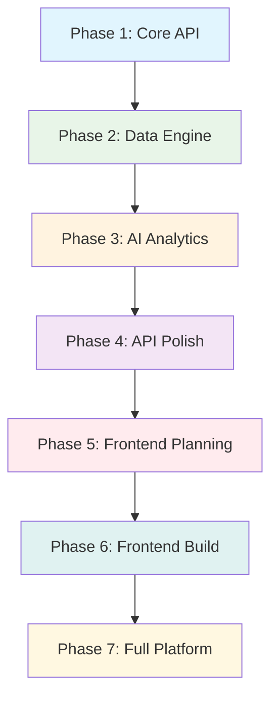

# Smart Business Intelligence Assistant - Comprehensive Project Plan

## Project Overview

Transform the existing Bee Agent Chat into a powerful Business Intelligence Assistant that allows users to ask questions about their business data in natural language and get insights with visualizations.

### **Executive Summary**
This document serves as the complete reference guide for building INSIGHTORA - an AI-powered Business Intelligence platform that democratizes data analytics through natural language processing. The platform will compete directly with Power BI, Tableau, and Looker by offering superior AI integration, ease of use, and cost-effectiveness.

### **Project Scope & Objectives**
- **Primary Goal**: Create a production-ready BI platform with natural language query capabilities
- **Target Users**: Business analysts, data scientists, executives, and non-technical stakeholders
- **Core Value Proposition**: Ask questions in plain English, get instant visualizations and insights
- **Success Criteria**: 100+ active users, 95%+ query success rate, <2s response times

### **Why Python for BI? The Strategic Advantage**

**Python is the ideal choice for Business Intelligence platforms** due to its unmatched ecosystem:

#### **Data Science Supremacy**
- **pandas & numpy**: Industry-standard data manipulation and analysis
- **scikit-learn**: Comprehensive machine learning for predictive analytics
- **matplotlib & seaborn**: Professional statistical visualizations
- **plotly**: Interactive, publication-quality charts and dashboards

#### **AI/ML Integration Excellence**
- **LangChain**: Advanced LLM orchestration for natural language processing
- **transformers**: State-of-the-art NLP models for query understanding
- **spacy**: Production-ready NLP for text processing
- **Groq Python SDK**: Native integration with fastest AI inference

#### **Database Connectivity Champion**
- **SQLAlchemy**: Powerful, flexible ORM supporting all major databases
- **psycopg2, pymongo, pyodbc**: Robust, mature database drivers
- **Superior data type handling**: Native support for complex data structures

#### **Performance & Scalability**
- **FastAPI**: Among the fastest Python frameworks, rivaling Node.js
- **Async/await**: Native asynchronous programming for concurrent operations
- **Celery**: Distributed task queue for background processing
- **Redis integration**: Seamless caching and session management

### Current Foundation (Transitioning to Python)
- **Backend**: FastAPI + SQLAlchemy (replacing Express + TypeScript)
- **Real-time**: FastAPI WebSockets (replacing Socket.IO)
- **AI Framework**: LangChain + Groq Python SDK (enhanced capabilities)
- **Data Processing**: pandas + numpy (native data science stack)
- **Deployment**: Docker + Kubernetes (production-ready)

### Target Product
A comprehensive Business Intelligence platform like Power BI where users can:
- **Connect Multiple Data Sources**: PostgreSQL, MySQL, SQL Server, Oracle, CSV, Excel, APIs
- **Natural Language Queries**: Ask "What were my top products last month?" and get instant insights
- **Interactive Dashboards**: Drag-and-drop dashboard builder with real-time data
- **Advanced Visualizations**: Charts, graphs, heatmaps, geographic maps with drill-down capabilities
- **AI-Powered Insights**: Automated pattern detection, anomaly alerts, predictive analytics
- **Enterprise Features**: Scheduled reports, data exports, role-based access, collaboration tools
- **Real-time Analytics**: Live data streaming, automatic refresh, real-time alerts
- **Mobile Responsive**: Access dashboards and reports from any device

### Key Requirements
- **Enterprise Authentication**: Multi-factor authentication, device trust, role-based access
- **Multi-Source Data Integration**: Support for 10+ database types and file formats
- **Real-time Processing**: Live data streaming and instant query responses
- **AI-Powered Analytics**: Natural language to SQL, automated insights, predictive modeling
- **Interactive Visualizations**: 20+ chart types with drill-down and filtering
- **Dashboard Builder**: Drag-and-drop interface with real-time collaboration
- **Enterprise Deployment**: Microservices architecture, horizontal scaling, cloud-ready
- **Mobile-First Design**: Responsive dashboards accessible on all devices

---

## 🏗️ **Technical Architecture & Design**

### **Free-Tier First Architecture**

The INSIGHTORA platform is designed to run entirely on **FREE services** during development and early stages, with clear upgrade paths as the platform grows.

### **Free Services Stack**
```
┌─────────────────────────────────────────────────────────────────┐
│                     FREE TIER DEPLOYMENT                       │
├─────────────────────────────────────────────────────────────────┤
│  Frontend (Later)     │  Backend (Current Focus)               │
│  ┌─────────────────┐  │  ┌─────────────────────────────────────┐ │
│  │ Vercel (Free)   │  │  │ Railway/Render (Free)               │ │
│  │ - 100GB bandwidth│  │  │ - 512MB RAM, 0.1 CPU              │ │
│  │ - Custom domain │  │  │ - PostgreSQL included               │ │
│  │ - Auto SSL      │  │  │ - Auto deployments                 │ │
│  └─────────────────┘  │  └─────────────────────────────────────┘ │
├─────────────────────────────────────────────────────────────────┤
│                    Database & Storage (FREE)                   │
│  ┌─────────────────┬─────────────────┬─────────────────────────┐ │
│  │ PostgreSQL      │ Redis Cache     │ File Storage            │ │
│  │ Railway: 1GB    │ Upstash: 10K    │ Cloudinary: 25GB       │ │
│  │ Supabase: 500MB │ requests/day    │ GitHub LFS: 1GB        │ │
│  │ Neon: 3GB       │ Redis Labs Free │ Vercel Blob: 1GB       │ │
│  └─────────────────┴─────────────────┴─────────────────────────┘ │
├─────────────────────────────────────────────────────────────────┤
│                      AI & Analytics (FREE)                     │
│  ┌─────────────────┬─────────────────┬─────────────────────────┐ │
│  │ Groq API        │ Hugging Face    │ OpenAI (Limited)        │ │
│  │ FREE: 14K RPM   │ FREE: Inference │ $5 credit monthly      │ │
│  │ LLaMA 3.1 8B    │ 30K chars/month │ GPT-3.5 Turbo          │ │
│  └─────────────────┴─────────────────┴─────────────────────────┘ │
└─────────────────────────────────────────────────────────────────┘
```

## 🏛️ **MODULAR ARCHITECTURE & DESIGN PRINCIPLES**

### **SOLID Principles Implementation**

Our architecture strictly follows SOLID principles for maintainable, scalable code:

#### **S - Single Responsibility Principle**
```python
# ❌ BAD: One class doing everything
class UserManager:
    def create_user(self): pass
    def send_email(self): pass
    def validate_password(self): pass
    def generate_jwt(self): pass

# ✅ GOOD: Each class has one responsibility
class UserService:           # User business logic only
    def create_user(self): pass
    
class EmailService:          # Email operations only
    def send_otp_email(self): pass
    
class PasswordValidator:     # Password validation only
    def validate_strength(self): pass
    
class JWTManager:           # Token operations only
    def generate_token(self): pass
```

#### **O - Open/Closed Principle**
```python
# ✅ Extensible data connectors without modifying existing code
class DataConnector(ABC):
    @abstractmethod
    def connect(self) -> bool: pass
    @abstractmethod
    def query(self, sql: str) -> DataFrame: pass

class PostgreSQLConnector(DataConnector):
    def connect(self) -> bool: pass
    def query(self, sql: str) -> DataFrame: pass

class MySQLConnector(DataConnector):
    def connect(self) -> bool: pass
    def query(self, sql: str) -> DataFrame: pass

# Adding new connectors doesn't modify existing ones
class MongoDBConnector(DataConnector):
    def connect(self) -> bool: pass
    def query(self, sql: str) -> DataFrame: pass
```

#### **L - Liskov Substitution Principle**
```python
# ✅ Any chart generator can be substituted
class ChartGenerator(ABC):
    @abstractmethod
    def generate(self, data: DataFrame) -> dict: pass

class BarChartGenerator(ChartGenerator):
    def generate(self, data: DataFrame) -> dict:
        # Returns consistent chart format
        return {"type": "bar", "data": [...], "config": {...}}

class LineChartGenerator(ChartGenerator):
    def generate(self, data: DataFrame) -> dict:
        # Same interface, different implementation
        return {"type": "line", "data": [...], "config": {...}}
```

#### **I - Interface Segregation Principle**
```python
# ✅ Small, focused interfaces instead of large ones
class Readable(Protocol):
    def read(self) -> DataFrame: pass

class Writable(Protocol):
    def write(self, data: DataFrame) -> bool: pass

class Queryable(Protocol):
    def query(self, sql: str) -> DataFrame: pass

# Classes implement only what they need
class CSVProcessor(Readable):
    def read(self) -> DataFrame: pass

class DatabaseConnector(Readable, Writable, Queryable):
    def read(self) -> DataFrame: pass
    def write(self, data: DataFrame) -> bool: pass
    def query(self, sql: str) -> DataFrame: pass
```

#### **D - Dependency Inversion Principle**
```python
# ✅ Depend on abstractions, not concretions
class AnalyticsService:
    def __init__(
        self,
        data_connector: DataConnector,  # Abstract interface
        ai_service: AIService,          # Abstract interface
        cache_service: CacheService     # Abstract interface
    ):
        self.data_connector = data_connector
        self.ai_service = ai_service
        self.cache_service = cache_service
    
    def process_query(self, query: str) -> dict:
        # Uses abstractions, not concrete implementations
        sql = self.ai_service.generate_sql(query)
        data = self.data_connector.query(sql)
        return self.cache_service.cache_result(data)
```

### **DRY Principle Implementation**

#### **Shared Utilities & Common Functions**
```python
# ✅ DRY: Reusable validation utilities
class ValidationUtils:
    @staticmethod
    def validate_email(email: str) -> bool:
        return re.match(r'^[^@]+@[^@]+\.[^@]+$', email) is not None
    
    @staticmethod
    def validate_password_strength(password: str) -> dict:
        return {
            "is_valid": len(password) >= 8,
            "has_uppercase": any(c.isupper() for c in password),
            "has_lowercase": any(c.islower() for c in password),
            "has_digit": any(c.isdigit() for c in password)
        }

# ✅ DRY: Reusable response formatters
class ResponseFormatter:
    @staticmethod
    def success_response(data: any, message: str = "Success") -> dict:
        return {"success": True, "message": message, "data": data}
    
    @staticmethod
    def error_response(error: str, code: int = 400) -> dict:
        return {"success": False, "error": error, "code": code}
```

#### **Configuration Management (DRY)**
```python
# ✅ DRY: Centralized configuration
class DatabaseConfig:
    @staticmethod
    def get_connection_string(db_type: str, config: dict) -> str:
        templates = {
            "postgresql": "postgresql://{user}:{password}@{host}:{port}/{database}",
            "mysql": "mysql://{user}:{password}@{host}:{port}/{database}",
            "sqlite": "sqlite:///{database}"
        }
        return templates[db_type].format(**config)
```

### **Modular Backend Architecture (Python FastAPI)**
```
┌─────────────────────────────────────────────────────────────────┐
│                     API Gateway & Load Balancer                │
│                    (FastAPI + Rate Limiting)                   │
├─────────────────────────────────────────────────────────────────┤
│                    Authentication Service                       │
│               (JWT + OAuth + 2FA + Device Trust)               │
│                     (FastAPI + SQLAlchemy)                     │
├─────────────────────────────────────────────────────────────────┤
│                        Core Services                           │
│  ┌───────────────┬───────────────┬───────────────┬──────────────┐
│  │   Data        │   Query       │  Analytics    │  Dashboard   │
│  │  Connector    │   Engine      │   Service     │   Service    │
│  │  (pandas+     │ (LangChain+   │ (scikit+      │ (plotly+     │
│  │  SQLAlchemy)  │   Groq+SQL)   │  pandas+AI)   │  FastAPI)    │
│  └───────────────┴───────────────┴───────────────┴──────────────┘
├─────────────────────────────────────────────────────────────────┤
│                       Data Processing Layer                     │
│  ┌───────────────┬───────────────┬───────────────┬──────────────┐
│  │   ETL/ELT     │   Stream      │   Cache       │   Export     │
│  │  (pandas+     │  Processing   │   Redis       │   Service    │
│  │   Celery)     │  (asyncio)    │ (redis-py)    │ (FastAPI)    │
│  └───────────────┴───────────────┴───────────────┴──────────────┘
├─────────────────────────────────────────────────────────────────┤
│                      Data Source Layer                         │
│  ┌───────────────┬───────────────┬───────────────┬──────────────┐
│  │  PostgreSQL   │    MySQL      │  SQL Server   │   Oracle     │
│  │  (psycopg2)   │ (mysql-conn)  │   (pyodbc)    │ (cx_Oracle)  │
│  │   MongoDB     │   Snowflake   │  BigQuery     │   Files      │
│  │  (pymongo)    │   (snowflake) │ (google-cloud)│  (pandas)    │
│  └───────────────┴───────────────┴───────────────┴──────────────┘
├─────────────────────────────────────────────────────────────────┤
│                       Storage & Queue                          │
│  ┌───────────────┬───────────────┬───────────────┬──────────────┐
│  │   User DB     │   Metadata    │   File        │   Message    │
│  │(PostgreSQL+   │     Store     │   Storage     │    Queue     │
│  │ SQLAlchemy)   │  (PostgreSQL) │   (S3/Local)  │  (Celery+    │
│  │               │               │               │   Redis)     │
│  └───────────────┴───────────────┴───────────────┴──────────────┘
└─────────────────────────────────────────────────────────────────┘
```

### Frontend Architecture (React/Next.js)
```
┌─────────────────────────────────────────────────────────────────┐
│              Progressive Web App (PWA) Frontend                 │
├─────────────────────────────────────────────────────────────────┤
│                    Authentication Module                        │
│  ┌───────────────┬───────────────┬───────────────┬──────────────┐
│  │   Register    │     Login     │      2FA      │   Profile    │
│  │     Page      │     Page      │  Verification │  Management  │
│  └───────────────┴───────────────┴───────────────┴──────────────┘
├─────────────────────────────────────────────────────────────────┤
│                      Main Application                          │
│  ┌───────────────┬───────────────┬───────────────┬──────────────┐
│  │   Dashboard   │  Data Sources │   Query       │   Reports    │
│  │    Builder    │   Manager     │  Interface    │   Gallery    │
│  └───────────────┴───────────────┴───────────────┴──────────────┘
├─────────────────────────────────────────────────────────────────┤
│                    Visualization Engine                        │
│  ┌───────────────┬───────────────┬───────────────┬──────────────┐
│  │   Chart       │    Table      │    Map        │   Custom     │
│  │ Components    │  Components   │  Components   │  Widgets     │
│  │  (D3.js)      │  (React Grid) │  (Mapbox)     │  (Pluggable) │
│  └───────────────┴───────────────┴───────────────┴──────────────┘
├─────────────────────────────────────────────────────────────────┤
│                      Core Services                             │
│  ┌───────────────┬───────────────┬───────────────┬──────────────┐
│  │   API Client  │  WebSocket    │   State       │    Theme     │
│  │   (Axios)     │ (Real-time)   │  Management   │   System     │
│  │               │               │   (Zustand)   │              │
│  └───────────────┴───────────────┴───────────────┴──────────────┘
├─────────────────────────────────────────────────────────────────┤
│                     Mobile & Desktop                           │
│  ┌───────────────┬───────────────┬───────────────┬──────────────┐
│  │   Responsive  │   Touch       │   Offline     │   Export     │
│  │     Design    │  Gestures     │    Mode       │   Features   │
│  └───────────────┴───────────────┴───────────────┴──────────────┘
└─────────────────────────────────────────────────────────────────┘
```

### Deployment Strategy
- **Backend Services**: Kubernetes cluster on AWS/GCP/Azure with auto-scaling
- **Frontend**: Vercel/Netlify with global CDN and edge computing
- **Databases**: 
  - Primary: PostgreSQL cluster with read replicas
  - Cache: Redis cluster for real-time data
  - Analytics: ClickHouse for OLAP queries
- **File Storage**: AWS S3/Google Cloud Storage with automatic backups
- **Monitoring**: Prometheus + Grafana + ELK stack for comprehensive monitoring
- **Security**: WAF, DDoS protection, end-to-end encryption

---

## 🚀 **REVISED DEVELOPMENT STRATEGY - FREE TIER & BACKEND FIRST**

### **Why Backend-First + Free Tier Strategy?**

**Financial Benefits:**
- Zero hosting costs during development (Railway/Render free tier)
- No database costs (PostgreSQL included in hosting)
- Free AI inference (Groq 14K requests/day)
- No frontend hosting needed initially (API-only)

**Technical Benefits:**
- API-first design = easier to add frontend later
- Can test with Postman/curl during development
- Multiple frontend options (React, Vue, mobile app)
- Better for attracting developer users first

**Business Benefits:**
- Faster time to market (no frontend complexity)
- Can validate core value proposition with API users
- Lower barrier to experimentation
- Clear upgrade path when revenue starts

### **Phase Strategy: API-First, Frontend Later**



## ⚠️ CURRENT BACKEND STATUS ANALYSIS

### What We Actually Have (REALISTIC ASSESSMENT):
- ✅ **FastAPI application structure** - Running successfully on port 8001
- ✅ **Modular backend architecture** - Clean `app/modules/auth/` structure
- ✅ **Database models** - Complete auth schema with all tables created
- ✅ **Auth API endpoints** - `/register`, `/login`, `/verify-registration`, `/verify-login`
- ✅ **JWT token system** - Working access/refresh token generation
- ✅ **API documentation** - Full Swagger docs showing all auth endpoints
- ✅ **Core infrastructure** - SQLAlchemy, Pydantic, error handling

### Critical Missing Components (BLOCKING ISSUES):
- ❌ **Email service integration** - OTP emails are logged, not sent (CRITICAL)
- ❌ **Complete auth flow testing** - End-to-end verification incomplete
- ❌ **Professional email templates** - Using basic logging placeholders
- ❌ **Production security hardening** - Rate limiting, account lockout need testing
- ❌ **Data source connections** - Not started yet
- ❌ **Query processing engine** - Not started yet
- ❌ **File upload processing** - Not started yet
- ❌ **Dashboard/visualization backend** - Not started yet

### Problem: **Authentication architecture is solid, but email delivery is missing** - Users can register but cannot complete email verification.

---

## � PHASE 1: Complete Authentication System (Week 1)

### Objective: Fix broken authentication and complete MFA system
### Duration: 3-4 days
### Priority: **CRITICAL** - Nothing else works without this

#### Day 1-2: OTP Verification System

**Critical Tasks:**
1. **Email Service Integration**
   ```python
   # app/services/email_service.py
   class EmailService:
       def send_registration_otp(self, email: str, otp: str, name: str):
           """Send OTP for email verification"""
       
       def send_login_otp(self, email: str, otp: str, name: str):
           """Send OTP for login verification"""
   ```

2. **OTP Generation & Management**
   ```python
   # app/services/otp_service.py
   class OTPService:
       def generate_otp(self, user_id: int, otp_type: str) -> str:
           """Generate 6-digit OTP with 10-minute expiry"""
       
       def verify_otp(self, user_id: int, otp: str, otp_type: str) -> bool:
           """Verify OTP and handle attempts/lockout"""
   ```

3. **Missing Authentication Endpoints**
   ```python
   # app/api/auth.py - ADD these endpoints
   @router.post("/verify-registration")
   @router.post("/verify-login") 
   @router.post("/resend-otp")
   ```

**Deliverables:**
- ✅ Working email OTP for registration verification
- ✅ Working email OTP for login verification  
- ✅ Complete authentication flow that actually works
- ✅ Professional email templates
- ✅ OTP rate limiting and security features

#### Day 3-4: Data Source Foundation

**Focus: Get basic data connectivity working**

1. **Database Connectors (Essential)**
   ```python
   # app/services/data_connector.py
   class DatabaseConnector:
       def connect_postgresql(self, config: dict) -> bool:
       def connect_mysql(self, config: dict) -> bool:
       def test_connection(self, source_id: int) -> bool:
       def get_schema(self, source_id: int) -> dict:
   ```

2. **File Upload Processing**
   ```python
   # app/services/file_processor.py  
   class FileProcessor:
       def process_csv(self, file_path: str) -> pd.DataFrame:
       def process_excel(self, file_path: str) -> pd.DataFrame:
       def infer_schema(self, df: pd.DataFrame) -> dict:
   ```

3. **Make Data Source Endpoints Functional**
   - Currently they are API stubs
   - Need actual database connections
   - File upload should store and process files

**Success Criteria:**
- Users can register → verify email → login successfully
- Users can connect to PostgreSQL/MySQL databases
- Users can upload CSV/Excel files and see data preview
- All authentication flows work end-to-end

---

## 🧠 PHASE 2: Query Processing Engine (Week 2)

### Objective: Natural language to SQL conversion and query execution
### Duration: 5-7 days

#### Day 1-3: NL-to-SQL Engine

**Core Implementation:**
```python
# app/services/query_processor.py
class QueryProcessor:
    def __init__(self):
        self.llm_client = groq.Client(api_key=settings.GROQ_API_KEY)
    
    def process_natural_language(self, query: str, schema: dict) -> dict:
        """Convert natural language to SQL using Groq/LLM"""
        prompt = self.build_sql_prompt(query, schema)
        sql_query = self.llm_client.generate_sql(prompt)
        return {
            "sql": sql_query,
            "explanation": "Generated SQL explanation",
            "confidence": 0.95
        }
    
    def execute_query(self, sql: str, data_source_id: int) -> pd.DataFrame:
        """Execute SQL query and return results"""
        
    def cache_results(self, query_hash: str, results: dict):
        """Cache query results for performance"""
```

**Key Features:**
- Groq integration for fast LLM inference
- Schema-aware SQL generation
- Query validation and sanitization
- Result caching system
- Error handling and fallbacks

#### Day 4-5: Query History and Management

**Implementation:**
```python
# app/api/queries.py - Make these endpoints functional
@router.post("/queries") # Execute natural language query
@router.get("/queries")  # Get query history  
@router.post("/queries/execute") # Execute raw SQL
@router.get("/queries/{id}/results") # Get cached results
```

**Features:**
- Query history tracking
- Favorite queries
- Query sharing
- Performance metrics

#### Day 6-7: Data Preview and Analysis

**Basic Analytics:**
```python
# app/services/data_analyzer.py
class DataAnalyzer:
    def basic_stats(self, df: pd.DataFrame) -> dict:
        """Generate basic statistics for dataset"""
    
    def detect_data_types(self, df: pd.DataFrame) -> dict:
        """Smart data type detection"""
    
    def suggest_visualizations(self, df: pd.DataFrame) -> list:
        """Suggest appropriate chart types"""
```

**Success Criteria:**
- Users can ask questions like "Show me sales by month"
- System generates and executes SQL queries
- Results are returned as structured data
- Query history is tracked and accessible

---

## 📊 PHASE 3: Visualization and Dashboard Backend (Week 3)

### Objective: Generate chart-ready data and dashboard management
### Duration: 5-7 days

#### Day 1-3: Chart Data Generation

**Core Service:**
```python
# app/services/chart_service.py
class ChartService:
    def generate_chart_data(self, df: pd.DataFrame, chart_type: str) -> dict:
        """Transform query results into chart-ready format"""
        
    def supported_chart_types(self) -> list:
        """Return available chart types based on data"""
        
    def auto_chart_suggestion(self, df: pd.DataFrame) -> dict:
        """AI-powered chart type suggestions"""
```

**Chart Types to Support:**
- Bar charts, line charts, pie charts
- Tables with sorting/filtering
- Basic metrics (KPIs)
- Time series charts

#### Day 4-5: Dashboard Management

**Implementation:**
```python
# app/api/dashboards.py - Make functional
@router.post("/dashboards")     # Create dashboard
@router.get("/dashboards")      # List dashboards
@router.put("/dashboards/{id}") # Update dashboard
@router.delete("/dashboards/{id}") # Delete dashboard
```

**Features:**
- Dashboard CRUD operations
- Widget management
- Layout persistence
- Dashboard sharing

#### Day 6-7: Real-time Data Updates

**WebSocket Integration:**
```python
# app/api/websocket.py
class DashboardWebSocket:
    async def connect(self, websocket: WebSocket, dashboard_id: int):
        """WebSocket connection for real-time updates"""
        
    async def send_data_update(self, dashboard_id: int, widget_id: int):
        """Push real-time data updates"""
```

**Success Criteria:**
- Query results can be visualized as charts
- Dashboards can be created and managed
- Basic real-time data updates work
- Dashboard layouts are persistent

---

## 🔐 PHASE 4: Security and Production Readiness (Week 4)

### Objective: Production security and deployment preparation  
### Duration: 3-5 days

#### Day 1-2: Security Hardening

**Enhanced Security:**
```python
# app/middleware/security.py
class SecurityMiddleware:
    def rate_limiting(self):
        """Implement rate limiting per user/IP"""
    
    def audit_logging(self):
        """Log all security events"""
        
    def input_validation(self):
        """Enhanced input sanitization"""
```

**Features:**
- Rate limiting per endpoint
- Audit logging for security events
- Input validation and sanitization
- SQL injection prevention
- XSS protection

#### Day 3-4: Performance Optimization

**Optimizations:**
- Database query optimization
- Result caching (Redis)
- Connection pooling
- Background task processing (Celery)
- File upload optimization

#### Day 5: Production Deployment

**Deployment:**
- Docker containerization
- Environment configuration
- Health checks and monitoring
- CI/CD pipeline setup
- Production database setup

**Success Criteria:**
- Backend is production-ready
- All security measures implemented
- Performance optimized for real usage
- Monitoring and logging in place

---

## 🎨 PHASE 5: Frontend Development (Weeks 5-6)

### Objective: Only start frontend after backend is 100% complete and tested
### Duration: 2 weeks  

**Note:** Frontend development only begins after backend is fully functional and tested. This ensures:
- No wasted frontend work due to backend changes
- Complete API specification is available
- Authentication flows are verified working
- Data flows are tested and optimized

#### Week 1: Core Frontend
- Authentication UI (registration, login, OTP verification)
- Data source connection interface
- Basic query interface

#### Week 2: Dashboard Interface  
- Dashboard builder
- Chart rendering
- Real-time updates

---

## 📋 IMMEDIATE ACTION PLAN - FREE TIER FOCUSED

### **Week 1: Get Backend Running on Free Hosting (CRITICAL)**

**Day 1: Deploy to Railway (Free)**
```bash
# Deploy current backend to Railway free tier
1. Connect GitHub repo to Railway
2. Set environment variables (DATABASE_URL auto-provided)
3. Deploy and test /health endpoint
4. Verify API docs at https://your-app.railway.app/docs
```

**Day 2-3: Fix Authentication with Free Email**
```bash
# Use free email service for OTP
1. Set up Gmail SMTP (free, 500 emails/day)
2. Implement /verify-registration endpoint
3. Implement /verify-login endpoint
4. Test complete auth flow on Railway
```

**Day 4-5: Basic Data Processing**
```bash
# File upload only (no database costs)
1. CSV upload and processing with pandas
2. Basic data preview endpoint
3. Simple query execution on uploaded data
4. Test with Postman/curl
```

### **Week 2: API-First User Testing**

**Day 1-2: API Documentation**
```bash
# Make API developer-friendly
1. Improve Swagger docs with examples
2. Add Postman collection
3. Create API usage guide
4. Add rate limiting info
```

**Day 3-5: Find First API Users**
```bash
# Get feedback before building frontend
1. Post on Reddit r/webdev, r/python
2. Share on Twitter/LinkedIn
3. Get 5 developers to test the API
4. Collect feedback on missing features
```

**Success Metric:** 
- Backend running on Railway (free)
- 5 developers successfully using the API
- Authentication flow working end-to-end
- CSV upload and basic queries functional

### Why This Approach:

✅ **Focus on working features** - No more API stubs  
✅ **Backend-first** - Complete backend before frontend  
✅ **Critical path** - Authentication blocks everything else  
✅ **Incremental testing** - Each phase builds on previous  
✅ **Real functionality** - No placeholder implementations

This plan eliminates the "fake completion" problem where we have API endpoints that don't actually work.
**This plan eliminates the "fake completion" problem where we have API endpoints that don't actually work.**

---

## 🚫 What We're NOT Doing (Avoiding Scope Creep & Costs)

### Removed from Current Plan:
- ❌ **Frontend development** (API-first, frontend later when profitable)
- ❌ **Paid services** (AWS, GCP, Azure - use free tiers only)
- ❌ **Database hosting costs** (use Railway/Render included PostgreSQL)
- ❌ **Advanced ML/AI features** (stick to free Groq API limits)
- ❌ **Mobile apps** (API can support mobile later)  
- ❌ **Complex visualizations** (return JSON, let frontend handle charts)
- ❌ **Enterprise features** (LDAP, SSO - focus on individual developers)
- ❌ **Big data connectors** (Snowflake, BigQuery cost money)
- ❌ **Real-time streaming** (WebSockets cost server resources)
- ❌ **Microservices architecture** (monolith is cheaper to host)
- ❌ **CDN costs** (use free tiers: Cloudflare, Vercel)
- ❌ **Monitoring services** (use free: Railway logs, Sentry free tier)

### Focus Areas Only (FREE TIER):
✅ **Working authentication with OTP** (Gmail SMTP - free 500/day)
✅ **CSV/Excel file upload** (no database hosting costs)  
✅ **Natural language to SQL** (Groq API - free 14K requests/day)
✅ **JSON API responses** (let frontend handle visualization)
✅ **Core security features** (JWT, rate limiting)
✅ **API documentation** (Swagger - built into FastAPI)
✅ **Free hosting** (Railway 512MB RAM, PostgreSQL included)

### Revenue Strategy (API-First):
💰 **Freemium API Model**
- Free: 100 queries/day, 10MB file uploads
- Pro ($9/month): 10K queries/day, 100MB files, priority support
- Business ($29/month): Unlimited queries, database connections, webhooks

### Success Definition (API-First):
A working BI API where developers can:
1. **Register and login** (with email verification)
2. **Upload CSV/Excel files** (no database costs initially)
3. **Ask questions** in natural language via API
4. **Get structured JSON responses** (charts data, not rendered charts)
5. **Access query history** and **manage data sources**

### Frontend Success Definition (Later Phase):
A working BI platform where end-users can:
1. **Use the API through a beautiful interface**
2. **Drag-and-drop dashboard builder**
3. **Real-time chart rendering**
4. **Share dashboards** and **collaborate**

**API must be profitable before building frontend.**

### Objective: Build responsive React frontend with modern UX
### Duration: 2 weeks

#### Week 9: Core UI Components & Authentication

##### Deliverables

1. **Modern React/Next.js Application**
   ```jsx
   // Component structure
   src/
   ├── components/
   │   ├── auth/              # Authentication components
   │   ├── dashboard/         # Dashboard builder
   │   ├── visualizations/    # Chart components
   │   ├── data-sources/      # Data connection UI
   │   └── common/           # Shared components
   ├── pages/
   │   ├── login.tsx         # Authentication pages
   │   ├── dashboard.tsx     # Main dashboard
   │   ├── query.tsx         # Query interface
   │   └── admin.tsx         # Admin panel
   └── hooks/
       ├── useAuth.ts        # Authentication hook
       ├── useQuery.ts       # Query processing
       └── useWebSocket.ts   # Real-time updates
   ```

2. **Authentication Integration**
   - Login/Register forms with validation
   - Two-factor authentication UI
   - Device trust management
   - Session handling and token refresh

3. **Responsive Design System**
   - Tailwind CSS for styling
   - Mobile-first approach
   - Dark/light theme support
   - Accessibility compliance (WCAG 2.1)

#### Week 10: Data Interface & Dashboard Builder

##### Deliverables

1. **Natural Language Query Interface**
   ```jsx
   const QueryInterface = () => {
     const [query, setQuery] = useState('');
     const [results, setResults] = useState(null);
     
     const handleQuery = async () => {
       const response = await fetch('/api/query', {
         method: 'POST',
         headers: { 'Content-Type': 'application/json' },
         body: JSON.stringify({ query, dataSourceId })
       });
       
       const data = await response.json();
       setResults(data);
     };
     
     return (
       <div className="query-interface">
         <input 
           type="text" 
           placeholder="Ask a question about your data..."
           value={query}
           onChange={(e) => setQuery(e.target.value)}
         />
         <button onClick={handleQuery}>Ask</button>
         {results && <ResultsDisplay data={results} />}
       </div>
     );
   };
   ```

2. **Interactive Dashboard Builder**
   - Drag-and-drop chart placement
   - Real-time chart customization
   - Dashboard sharing and collaboration
   - Export and printing capabilities

3. **Data Source Management UI**
   - Connection wizard with validation
   - Schema browser and preview
   - Connection testing interface
   - File upload with progress tracking

**Success Criteria:**
- Fully responsive across all devices
- Intuitive natural language query interface
- Interactive dashboard builder
- Seamless authentication flow
- Real-time data updates

---

## 🚀 PHASE 6: Advanced Analytics & ML (Weeks 11-12)

### Objective: Implement machine learning and predictive analytics
### Duration: 2 weeks

#### Week 11: Statistical Analysis & Pattern Detection

##### Deliverables

1. **Advanced Analytics Engine**
   ```python
   # Machine learning integration
   from sklearn.cluster import KMeans
   from sklearn.linear_model import LinearRegression
   from sklearn.ensemble import IsolationForest
   
   class AdvancedAnalytics:
       def detect_patterns(self, df: pd.DataFrame) -> Dict[str, Any]:
           """Automatically detect patterns in data"""
           results = {}
           
           # Clustering analysis
           if len(df.select_dtypes(include=[np.number]).columns) >= 2:
               numeric_data = df.select_dtypes(include=[np.number])
               kmeans = KMeans(n_clusters=3)
               clusters = kmeans.fit_predict(numeric_data)
               results['clusters'] = clusters.tolist()
           
           # Trend analysis
           if 'date' in df.columns:
               results['trends'] = self.analyze_trends(df)
           
           # Anomaly detection
           results['anomalies'] = self.detect_anomalies(df)
           
           return results
       
       def predictive_analysis(self, df: pd.DataFrame, target_column: str):
           """Generate predictions based on historical data"""
           # Time series forecasting
           # Regression analysis
           # Classification models
           pass
   ```

2. **Automated Insights Generation**
   ```python
   class InsightGenerator:
       def generate_insights(self, df: pd.DataFrame) -> List[Insight]:
           insights = []
           
           # Statistical insights
           insights.extend(self.statistical_insights(df))
           
           # Trend insights
           insights.extend(self.trend_insights(df))
           
           # Correlation insights
           insights.extend(self.correlation_insights(df))
           
           return insights
   ```

3. **Real-time Monitoring & Alerts**
   - Threshold-based alerting
   - Anomaly detection notifications
   - Scheduled report generation
   - Email/SMS alert integration

#### Week 12: Predictive Modeling & Forecasting

##### Deliverables

1. **Time Series Forecasting**
   ```python
   # Using Prophet for time series forecasting
   from prophet import Prophet
   
   class ForecastingEngine:
       def generate_forecast(self, df: pd.DataFrame, periods: int = 30):
           model = Prophet()
           model.fit(df)
           
           future = model.make_future_dataframe(periods=periods)
           forecast = model.predict(future)
           
           return forecast
   ```

2. **Machine Learning Models**
   - Customer segmentation (K-Means clustering)
   - Sales prediction (Linear/Polynomial regression)
   - Churn prediction (Random Forest)
   - Demand forecasting (ARIMA/Prophet)

3. **Model Management & Deployment**
   - Model versioning and tracking
   - Performance monitoring
   - A/B testing framework
   - Model retraining pipelines

**Success Criteria:**
- Automated pattern detection in data
- Accurate predictive models (>80% accuracy)
- Real-time anomaly detection
- Scheduled insights and reports
- Model performance monitoring

---

## 🌐 PHASE 7: Enterprise Features & Deployment (Weeks 13-14)

### Objective: Production deployment with enterprise-grade features
### Duration: 2 weeks

#### Week 13: Performance Optimization & Scaling

##### Deliverables

1. **Performance Optimization**
   ```python
   # Caching strategy with Redis
   import redis
   from functools import wraps
   
   redis_client = redis.Redis(host='localhost', port=6379, decode_responses=True)
   
   def cache_query_result(expiration=3600):
       def decorator(func):
           @wraps(func)
           async def wrapper(*args, **kwargs):
               cache_key = f"query:{hash(str(args) + str(kwargs))}"
               cached_result = redis_client.get(cache_key)
               
               if cached_result:
                   return json.loads(cached_result)
               
               result = await func(*args, **kwargs)
               redis_client.setex(cache_key, expiration, json.dumps(result))
               return result
           return wrapper
       return decorator
   ```

2. **Horizontal Scaling Architecture**
   - Load balancer configuration
   - Database connection pooling
   - Microservices communication
   - Auto-scaling policies

3. **Security Hardening**
   - SQL injection prevention
   - Rate limiting per user/IP
   - Data encryption at rest and transit
   - Audit logging and compliance

#### Week 14: Production Deployment & Monitoring

##### Deliverables

1. **Docker & Kubernetes Deployment**
   ```yaml
   # kubernetes deployment
   apiVersion: apps/v1
   kind: Deployment
   metadata:
     name: bi-platform-backend
   spec:
     replicas: 3
     selector:
       matchLabels:
         app: bi-platform
     template:
       metadata:
         labels:
           app: bi-platform
       spec:
         containers:
         - name: backend
           image: bi-platform:latest
           ports:
           - containerPort: 8000
           env:
           - name: DATABASE_URL
             valueFrom:
               secretKeyRef:
                 name: db-secret
                 key: url
   ```

2. **Monitoring & Observability**
   - Application performance monitoring (APM)
   - Log aggregation and analysis
   - Health checks and uptime monitoring
   - Error tracking and alerting

3. **CI/CD Pipeline**
   - Automated testing (unit, integration, e2e)
   - Code quality checks (linting, security scans)
   - Automated deployment to staging/production
   - Database migration management

**Success Criteria:**
- 99.9% uptime with load balancing
- Response times under 500ms for queries
- Automated deployment pipeline
- Comprehensive monitoring and alerting
- Security compliance (SOC 2, GDPR ready)
   - MongoDB (pymongo)
   - Oracle (cx_Oracle)
   ```

2. **File Processing Engine**
   ```python
   # File format support with pandas
   - CSV (pandas.read_csv - up to 100MB)
   - Excel (pandas.read_excel - .xlsx, .xls)
   - JSON (pandas.read_json - structured data)
   - Parquet (pandas.read_parquet - big data)
   - Real-time streaming (FastAPI WebSockets)
   ```

3. **Data Connection APIs**
   ```python
   # FastAPI endpoints
   POST /api/connections/database     # Add database connection
   GET  /api/connections              # List all connections
   PUT  /api/connections/{id}/test    # Test connection health
   DELETE /api/connections/{id}       # Remove connection
   POST /api/data/upload              # Upload files (CSV/Excel)
   GET  /api/data/sources             # List all data sources
   ```

4. **Data Type Detection & Validation**
   - Automatic schema inference (pandas.DataFrame.dtypes)
   - Data type mapping (pandas dtype conversion)
   - Data quality checks (pandas.DataFrame.isnull())
   - Missing value detection (pandas data profiling)

#### Week 4: Data Query Interface & Caching

##### Deliverables

1. **Unified Query Interface**
   ```python
   # Query abstraction layer with SQLAlchemy
   - SQL query builder (SQLAlchemy Core)
   - NoSQL query translator (pymongo queries)
   - File data querying (pandas SQL-like operations)
   - Query optimization (pandas query optimization)
   ```

2. **Real-time Data Pipeline**
   ```python
   # Streaming and real-time features
   - WebSocket connections (FastAPI WebSockets)
   - Data refresh scheduling (Celery Beat)
   - Change detection (pandas diff operations)
   - Background data sync (Celery workers)
   ```

3. **Caching & Performance**
   ```python
   # Performance optimization
   - Redis caching layer (redis-py)
   - Query result caching (pandas + Redis)
   - Metadata caching (SQLAlchemy + Redis)
   - Connection pooling (SQLAlchemy Engine)
   ```

---

## 🧠 PHASE 3: AI Analytics Engine (Weeks 5-6)

### Objective: Implement natural language processing and AI-powered insights
### Duration: 2 weeks

#### Week 5: Natural Language to SQL

##### Deliverables

1. **NL-to-SQL Conversion Engine**
   ```python
   # AI-powered query generation with LangChain
   - Natural language understanding (LangChain)
   - SQL query generation (LangChain + Groq)
   - Query optimization (SQLAlchemy + pandas)
   - Context-aware building (LangChain Memory)
   ```

2. **AI Query Interface**
   ```python
   # FastAPI endpoints for AI queries
   POST /api/ai/query                 # Natural language query
   POST /api/ai/explain               # Explain data patterns
   GET  /api/ai/suggestions           # Get query suggestions
   POST /api/ai/insights              # Generate insights
   ```

3. **Conversation Context**
   ```python
   # Conversational BI features with LangChain
   - Query history and context (LangChain Memory)
   - Follow-up question handling (LangChain Chains)
   - Data exploration suggestions (AI recommendations)
   - User preference learning (ML personalization)
   ```

#### Week 6: Automated Insights & Recommendations

##### Deliverables

1. **Pattern Detection Engine**
   ```python
   # AI-powered analytics with scikit-learn
   - Trend detection (pandas + numpy)
   - Anomaly identification (scikit-learn)
   - Correlation analysis (pandas.corr())
   - Predictive modeling (scikit-learn ML)
   ```

2. **Insight Generation**
   ```python
   # Automated insights with pandas + AI
   - Key metrics identification (pandas.describe())
   - Performance alerts (threshold monitoring)
   - Data quality reports (pandas profiling)
   - Business KPI tracking (custom metrics)
   ```

3. **Recommendation System**
   ```python
   # Smart recommendations with ML
   - Chart type suggestions (rule-based + ML)
   - Data exploration paths (graph algorithms)
   - Optimization recommendations (performance analysis)
   - Best practice guidance (domain knowledge)
   ```

---

## 📊 PHASE 4: Visualization & Chart Engine (Weeks 7-8)

### Objective: Build comprehensive visualization and charting capabilities
### Duration: 2 weeks

#### Week 7: Core Chart Components

##### Deliverables

1. **Chart Library Integration**
   ```python
   # Python visualization ecosystem
   - plotly for interactive charts (plotly.py)
   - matplotlib for statistical plots
   - seaborn for advanced statistical visualization
   - FastAPI endpoints for chart generation
   ```

2. **Chart Types Support**
   ```python
   # Comprehensive chart support
   # Standard charts (plotly + matplotlib)
   - Bar, Line, Pie, Doughnut
   - Area, Scatter, Bubble
   - Histogram, Box plot
   - Heatmap, Treemap
   
   # Advanced charts (plotly + seaborn)
   - Gantt charts (plotly.timeline)
   - Sankey diagrams (plotly.sankey)
   - Geographic maps (plotly.geo)
   - Time series (plotly.timeseries)
   ```

3. **Interactive Features**
   ```python
   # Chart interactivity with plotly
   - Zoom and pan (plotly built-in)
   - Drill-down functionality (callback functions)
   - Cross-chart filtering (plotly dash)
   - Real-time updates (FastAPI WebSockets)
   ```

#### Week 8: Dashboard Builder

##### Deliverables

1. **Drag-and-Drop Dashboard**
   ```typescript
   // Dashboard builder features
   - Grid-based layout system
   - Component library
   - Resize and reposition
   - Template gallery
   ```

2. **Dashboard Management**
   ```
   POST /api/dashboards              # Create dashboard
   GET  /api/dashboards              # List dashboards
   PUT  /api/dashboards/:id          # Update dashboard
   DELETE /api/dashboards/:id        # Delete dashboard
   POST /api/dashboards/:id/share    # Share dashboard
   ```

3. **Real-time Updates**
   ```typescript
   // Live dashboard features
   - WebSocket connections
   - Auto-refresh intervals
   - Real-time data streaming
   - Performance monitoring
   ```

---

## 🎨 PHASE 5: Frontend Planning & Architecture (Week 9)

### Objective: Plan frontend architecture and choose free deployment strategy
### Duration: 1 week

**Note: Frontend development is POSTPONED until backend is 100% complete and generating revenue**

#### Week 9: Frontend Strategy & Planning

##### Deliverables

1. **Modular Frontend Architecture (SOLID/DRY Compliant)**
   ```typescript
   // 🏗️ RECOMMENDED: Next.js + TypeScript + Modular Architecture
   
   Technology Stack:
   - Next.js 14+ (App Router for better organization)
   - TypeScript (Full type safety)
   - Tailwind CSS (Utility-first, DRY styling)
   - Zustand (Lightweight state management)
   - React Query (Server state management)
   - React Hook Form (Form management)
   - Zod (Runtime type validation)
   - Storybook (Component documentation)
   
   Deployment: Vercel (FREE: 100GB bandwidth, custom domain)
   ```

   **Modular Frontend Structure (SOLID Principles)**
   ```typescript
   frontend/
   ├── src/
   │   ├── app/                    # 📱 Next.js App Router (Route-based modules)
   │   │   ├── (auth)/            # Authentication routes group
   │   │   │   ├── login/
   │   │   │   ├── register/
   │   │   │   └── layout.tsx     # Auth-specific layout
   │   │   ├── (dashboard)/       # Dashboard routes group
   │   │   │   ├── analytics/
   │   │   │   ├── data-sources/
   │   │   │   ├── charts/
   │   │   │   └── layout.tsx     # Dashboard layout
   │   │   ├── api/               # API routes (if needed)
   │   │   ├── globals.css
   │   │   └── layout.tsx         # Root layout
   │   │
   │   ├── components/            # 🧩 Reusable UI Components (DRY)
   │   │   ├── ui/               # Base UI components
   │   │   │   ├── Button.tsx    # Single responsibility
   │   │   │   ├── Input.tsx
   │   │   │   ├── Modal.tsx
   │   │   │   ├── Card.tsx
   │   │   │   └── index.ts      # Barrel exports
   │   │   ├── forms/            # Form components
   │   │   │   ├── AuthForm.tsx
   │   │   │   ├── DataSourceForm.tsx
   │   │   │   └── QueryForm.tsx
   │   │   ├── charts/           # Chart components (Strategy Pattern)
   │   │   │   ├── BaseChart.tsx # Abstract chart interface
   │   │   │   ├── BarChart.tsx  # Specific implementations
   │   │   │   ├── LineChart.tsx
   │   │   │   ├── PieChart.tsx
   │   │   │   └── ChartFactory.tsx # Chart factory
   │   │   └── layout/           # Layout components
   │   │       ├── Header.tsx
   │   │       ├── Sidebar.tsx
   │   │       └── Footer.tsx
   │   │
   │   ├── modules/              # 📦 Feature Modules (Single Responsibility)
   │   │   ├── auth/            # Authentication module
   │   │   │   ├── components/  # Auth-specific components
   │   │   │   │   ├── LoginForm.tsx
   │   │   │   │   ├── RegisterForm.tsx
   │   │   │   │   └── OTPVerification.tsx
   │   │   │   ├── hooks/       # Auth-specific hooks
   │   │   │   │   ├── useAuth.ts
   │   │   │   │   ├── useLogin.ts
   │   │   │   │   └── useRegister.ts
   │   │   │   ├── services/    # Auth API services
   │   │   │   │   ├── authApi.ts
   │   │   │   │   └── tokenManager.ts
   │   │   │   ├── stores/      # Auth state management
   │   │   │   │   └── authStore.ts
   │   │   │   ├── types/       # Auth-specific types
   │   │   │   │   └── auth.types.ts
   │   │   │   └── utils/       # Auth utilities
   │   │   │       ├── validation.ts
   │   │   │       └── storage.ts
   │   │   │
   │   │   ├── data-sources/    # Data source management module
   │   │   │   ├── components/
   │   │   │   │   ├── DataSourceList.tsx
   │   │   │   │   ├── ConnectionWizard.tsx
   │   │   │   │   └── FileUpload.tsx
   │   │   │   ├── hooks/
   │   │   │   │   ├── useDataSources.ts
   │   │   │   │   └── useFileUpload.ts
   │   │   │   ├── services/
   │   │   │   │   └── dataSourceApi.ts
   │   │   │   ├── stores/
   │   │   │   │   └── dataSourceStore.ts
   │   │   │   └── types/
   │   │   │       └── dataSource.types.ts
   │   │   │
   │   │   ├── analytics/       # Analytics & queries module
   │   │   │   ├── components/
   │   │   │   │   ├── QueryInterface.tsx
   │   │   │   │   ├── QueryHistory.tsx
   │   │   │   │   └── ResultsDisplay.tsx
   │   │   │   ├── hooks/
   │   │   │   │   ├── useQuery.ts
   │   │   │   │   └── useQueryHistory.ts
   │   │   │   ├── services/
   │   │   │   │   └── analyticsApi.ts
   │   │   │   └── stores/
   │   │   │       └── queryStore.ts
   │   │   │
   │   │   ├── dashboards/      # Dashboard builder module
   │   │   │   ├── components/
   │   │   │   │   ├── DashboardGrid.tsx
   │   │   │   │   ├── WidgetEditor.tsx
   │   │   │   │   └── DashboardList.tsx
   │   │   │   ├── hooks/
   │   │   │   │   ├── useDashboard.ts
   │   │   │   │   └── useWidgets.ts
   │   │   │   ├── services/
   │   │   │   │   └── dashboardApi.ts
   │   │   │   └── stores/
   │   │   │       └── dashboardStore.ts
   │   │   │
   │   │   └── visualizations/  # Chart & visualization module
   │   │       ├── components/
   │   │       │   ├── ChartRenderer.tsx
   │   │       │   ├── ChartControls.tsx
   │   │       │   └── ChartExport.tsx
   │   │       ├── hooks/
   │   │       │   ├── useChart.ts
   │   │       │   └── useChartData.ts
   │   │       ├── services/
   │   │       │   └── chartApi.ts
   │   │       └── utils/
   │   │           ├── chartHelpers.ts
   │   │           └── dataTransformers.ts
   │   │
   │   ├── shared/              # 🔄 Shared Utilities (DRY)
   │   │   ├── hooks/          # Reusable hooks
   │   │   │   ├── useApi.ts   # Generic API hook
   │   │   │   ├── useLocalStorage.ts
   │   │   │   ├── useDebounce.ts
   │   │   │   └── useWebSocket.ts
   │   │   ├── services/       # Shared services
   │   │   │   ├── apiClient.ts # HTTP client (Dependency Inversion)
   │   │   │   ├── errorHandler.ts
   │   │   │   └── logger.ts
   │   │   ├── stores/         # Global state
   │   │   │   ├── appStore.ts
   │   │   │   └── themeStore.ts
   │   │   ├── types/          # Shared TypeScript types
   │   │   │   ├── api.types.ts
   │   │   │   ├── common.types.ts
   │   │   │   └── index.ts
   │   │   ├── utils/          # Utility functions
   │   │   │   ├── formatters.ts
   │   │   │   ├── validators.ts
   │   │   │   ├── constants.ts
   │   │   │   └── helpers.ts
   │   │   └── constants/      # Application constants
   │   │       ├── routes.ts
   │   │       ├── api.ts
   │   │       └── config.ts
   │   │
   │   └── styles/             # 🎨 Styling (DRY)
   │       ├── globals.css
   │       ├── components.css  # Component-specific styles
   │       └── utilities.css   # Utility classes
   │
   ├── public/                 # Static assets
   ├── tests/                  # Testing
   │   ├── __mocks__/         # Mock implementations
   │   ├── components/        # Component tests
   │   ├── modules/           # Module tests
   │   ├── e2e/              # End-to-end tests
   │   └── utils/            # Test utilities
   │
   ├── docs/                  # Documentation
   │   ├── components/        # Component documentation
   │   └── modules/          # Module documentation
   │
   ├── .storybook/           # Storybook configuration
   ├── tailwind.config.js    # Tailwind configuration
   ├── next.config.js        # Next.js configuration
   ├── tsconfig.json         # TypeScript configuration
   └── package.json          # Dependencies
   ```

2. **Frontend SOLID Principles Implementation**
   ```typescript
   // ✅ Single Responsibility Principle
   // Each component has one clear purpose
   
   // ❌ BAD: Component doing everything
   const Dashboard = () => {
     // Authentication logic
     // Data fetching
     // Chart rendering
     // State management
     // API calls
   }
   
   // ✅ GOOD: Separated responsibilities
   const Dashboard = () => {
     const { user } = useAuth()           // Auth responsibility
     const { data } = useQueryData()      // Data fetching responsibility
     const { charts } = useCharts()       // Chart responsibility
     
     return (
       <DashboardLayout>              {/* Layout responsibility */}
         <QueryInterface />           {/* Query responsibility */}
         <ChartRenderer data={data} /> {/* Rendering responsibility */}
       </DashboardLayout>
     )
   }
   
   // ✅ Open/Closed Principle - Extensible chart system
   interface ChartProps {
     data: ChartData
     config: ChartConfig
   }
   
   // Base chart interface
   const BaseChart: React.FC<ChartProps> = ({ data, config }) => {
     // Common chart logic
   }
   
   // Specific implementations (can add new ones without modifying existing)
   const BarChart: React.FC<ChartProps> = (props) => <BaseChart {...props} type="bar" />
   const LineChart: React.FC<ChartProps> = (props) => <BaseChart {...props} type="line" />
   const PieChart: React.FC<ChartProps> = (props) => <BaseChart {...props} type="pie" />
   
   // ✅ Liskov Substitution Principle - Interchangeable API services
   interface ApiService {
     get<T>(url: string): Promise<T>
     post<T>(url: string, data: any): Promise<T>
   }
   
   class HttpApiService implements ApiService {
     async get<T>(url: string): Promise<T> { /* HTTP implementation */ }
     async post<T>(url: string, data: any): Promise<T> { /* HTTP implementation */ }
   }
   
   class MockApiService implements ApiService {
     async get<T>(url: string): Promise<T> { /* Mock implementation */ }
     async post<T>(url: string, data: any): Promise<T> { /* Mock implementation */ }
   }
   
   // ✅ Interface Segregation Principle - Small, focused interfaces
   interface Readable {
     read(): Promise<Data>
   }
   
   interface Writable {
     write(data: Data): Promise<void>
   }
   
   interface Queryable {
     query(sql: string): Promise<QueryResult>
   }
   
   // Components implement only what they need
   const DataViewer: React.FC = () => {
     const dataService: Readable = useDataService()
     // Only needs read capability
   }
   
   // ✅ Dependency Inversion Principle - Depend on abstractions
   const QueryInterface: React.FC<{ apiService: ApiService }> = ({ apiService }) => {
     // Depends on ApiService interface, not concrete implementation
     const handleQuery = async (query: string) => {
       const result = await apiService.post('/queries', { query })
       return result
     }
   }
   ```

3. **Frontend DRY Implementation**
   ```typescript
   // ✅ DRY: Reusable custom hooks
   const useApi = <T>(url: string) => {
     const [data, setData] = useState<T | null>(null)
     const [loading, setLoading] = useState(false)
     const [error, setError] = useState<string | null>(null)
     
     // Reusable API logic
     const fetchData = useCallback(async () => {
       setLoading(true)
       try {
         const response = await apiClient.get<T>(url)
         setData(response)
       } catch (err) {
         setError(err.message)
       } finally {
         setLoading(false)
       }
     }, [url])
     
     return { data, loading, error, refetch: fetchData }
   }
   
   // ✅ DRY: Reusable form validation
   const validationSchemas = {
     email: z.string().email('Invalid email format'),
     password: z.string().min(8, 'Password must be at least 8 characters'),
     required: (field: string) => z.string().min(1, `${field} is required`)
   }
   
   // ✅ DRY: Reusable UI components with consistent styling
   const Button: React.FC<ButtonProps> = ({ 
     variant = 'primary', 
     size = 'md', 
     children, 
     ...props 
   }) => {
     const baseClasses = 'font-medium rounded-lg transition-colors'
     const variantClasses = {
       primary: 'bg-blue-600 hover:bg-blue-700 text-white',
       secondary: 'bg-gray-200 hover:bg-gray-300 text-gray-900',
       danger: 'bg-red-600 hover:bg-red-700 text-white'
     }
     const sizeClasses = {
       sm: 'px-3 py-1.5 text-sm',
       md: 'px-4 py-2 text-base',
       lg: 'px-6 py-3 text-lg'
     }
     
     const className = `${baseClasses} ${variantClasses[variant]} ${sizeClasses[size]}`
     
     return <button className={className} {...props}>{children}</button>
   }
   
   // ✅ DRY: Centralized API configuration
   const apiConfig = {
     baseURL: process.env.NEXT_PUBLIC_API_URL,
     timeout: 10000,
     headers: {
       'Content-Type': 'application/json'
     }
   }
   
   // ✅ DRY: Reusable error handling
   const useErrorHandler = () => {
     const showError = useCallback((error: Error) => {
       // Centralized error handling logic
       console.error(error)
       toast.error(error.message)
     }, [])
     
     return { showError }
   }
   ```

4. **API Integration Architecture**
   ```typescript
   // 🔌 Clean API integration with dependency inversion
   
   // Abstract API service interface
   interface IApiService {
     auth: {
       register(data: RegisterData): Promise<AuthResponse>
       login(data: LoginData): Promise<AuthResponse>
       verifyOTP(data: OTPData): Promise<AuthResponse>
       logout(): Promise<void>
     }
     dataSources: {
       list(): Promise<DataSource[]>
       create(data: CreateDataSourceData): Promise<DataSource>
       test(id: string): Promise<ConnectionStatus>
       delete(id: string): Promise<void>
     }
     analytics: {
       query(data: QueryData): Promise<QueryResult>
       history(): Promise<QueryHistory[]>
       insights(dataSourceId: string): Promise<Insight[]>
     }
     charts: {
       generate(data: ChartData): Promise<Chart>
       types(): Promise<ChartType[]>
       export(chartId: string, format: ExportFormat): Promise<Blob>
     }
   }
   
   // Concrete implementation
   class ApiService implements IApiService {
     constructor(private httpClient: HttpClient) {}
     
     auth = {
       register: (data: RegisterData) => 
         this.httpClient.post<AuthResponse>('/auth/register', data),
       login: (data: LoginData) => 
         this.httpClient.post<AuthResponse>('/auth/login', data),
       // ... other methods
     }
     
     // ... other service implementations
   }
   
   // Dependency injection in React
   const ApiProvider: React.FC<{ children: React.ReactNode }> = ({ children }) => {
     const apiService = useMemo(() => new ApiService(httpClient), [])
     
     return (
       <ApiContext.Provider value={apiService}>
         {children}
       </ApiContext.Provider>
     )
   }
   
   // Usage in components
   const LoginForm: React.FC = () => {
     const apiService = useContext(ApiContext)
     const { showError } = useErrorHandler()
     
     const handleLogin = async (data: LoginData) => {
       try {
         const response = await apiService.auth.login(data)
         // Handle success
       } catch (error) {
         showError(error)
       }
     }
   }
   ```

3. **Free Tier Deployment Strategy**
   ```yaml
   # Deployment pipeline (all free)
   
   Development:
     - Local development server
     - Backend API at localhost:8000
     - Hot reload for rapid iteration
   
   Staging:
     - Vercel preview deployments
     - Automatic PR previews
     - Backend on Railway staging
   
   Production:
     - Vercel production deployment
     - Custom domain (free)
     - Backend on Railway production
     - Automatic SSL certificates
   ```

**Success Criteria:**
- Frontend architecture documented and approved
- Free deployment strategy validated
- API integration plan complete
- Ready to start frontend development when backend is revenue-positive

## 🎨 PHASE 6: Frontend Development (Weeks 10-12) - **FUTURE PHASE**

### Objective: Build frontend only after backend generates revenue
### Duration: 3 weeks (when ready)

**Prerequisites for starting frontend:**
- ✅ Backend API is 100% functional
- ✅ At least 10 API users providing feedback
- ✅ Revenue stream established (API subscriptions)
- ✅ Free tier limits are being approached

#### Week 10-12: Frontend Implementation (Future)

#### Week 9: Dashboard UI Components

##### Deliverables

1. **React Dashboard Framework**
   ```typescript
   // Dashboard components
   - Grid layout system (react-grid-layout)
   - Chart wrapper components
   - Filter and control panels
   - Data table components
   ```

2. **Navigation & User Experience**
   ```typescript
   // UI/UX features
   - Sidebar navigation
   - Search and filtering
   - Responsive design
   - Dark/light themes
   ```

3. **Data Source Management UI**
   ```typescript
   // Connection management
   - Database connection wizard
   - File upload interface
   - Connection testing UI
   - Data preview components
   ```

#### Week 10: Advanced Dashboard Features

##### Deliverables

1. **Interactive Query Builder**
   ```typescript
   // Query interface
   - Visual query builder
   - SQL editor with syntax highlighting
   - Query history and favorites
   - Share and save queries
   ```

2. **Collaboration Features**
   ```typescript
   // Team collaboration
   - Dashboard sharing
   - Comments and annotations
   - Version history
   - Team workspaces
   ```

3. **Export & Reporting**
   ```typescript
   // Export features
   - PDF report generation
   - Excel export
   - Scheduled reports
   - Email notifications
   ```

---

## 🏢 PHASE 6: Enterprise Features (Weeks 11-12)

### Objective: Implement enterprise-grade features for production deployment
### Duration: 2 weeks

#### Week 11: Advanced Analytics & Performance

##### Deliverables

1. **Advanced Analytics**
   ```typescript
   // Enterprise analytics
   - Statistical analysis
   - Cohort analysis
   - Funnel analysis
   - A/B testing framework
   ```

2. **Performance Optimization**
   ```typescript
   // Performance features
   - Query optimization
   - Data virtualization
   - Lazy loading
   - Memory management
   ```

3. **Security & Compliance**
   ```typescript
   // Enterprise security
   - Role-based access control (RBAC)
   - Data masking and encryption
   - Audit logging
   - GDPR compliance features
   ```

#### Week 12: Production Deployment & Monitoring

##### Deliverables

1. **Production Infrastructure**
   ```yaml
   # Kubernetes deployment
   - Auto-scaling configuration
   - Load balancing setup
   - Database clustering
   - Redis caching cluster
   ```

2. **Monitoring & Observability**
   ```typescript
   // Monitoring stack
   - Application performance monitoring
   - Error tracking and alerting
   - Usage analytics
   - Health check endpoints
   ```

3. **Enterprise Integration**
   ```typescript
   // Integration features
   - SSO (SAML, OAuth)
   - API integrations
   - Webhook support
   - Custom branding
   ```

---

## 🚀 PHASE 7: Advanced BI Features (Weeks 13-14)

### Objective: Implement Power BI-like advanced features
### Duration: 2 weeks

#### Advanced Features

1. **Machine Learning Integration**
   ```typescript
   // ML capabilities
   - Predictive analytics
   - Anomaly detection
   - Clustering analysis
   - Time series forecasting
   ```

2. **Big Data Support**
   ```typescript
   // Scalability features
   - Data lake connections
   - Streaming analytics
   - Distributed processing
   - Cloud storage integration
   ```

3. **Mobile Application**
   ```typescript
   // Mobile features
   - React Native app
   - Offline mode
   - Push notifications
   - Touch-optimized charts
   ```  
   ├── Hash password
   ├── Create user (isVerified: false)
   ├── Generate 6-digit OTP
   ├── Send registration OTP email
   └── Return: { message: "OTP sent", email: "masked_email" }

2. POST /api/auth/verify-registration
   ├── Validate OTP (check expiry, attempts)
   ├── Mark user as verified (isVerified: true)
   ├── Mark OTP as used
   ├── Send welcome email with platform features
   ├── Generate initial JWT tokens
   └── Return: { tokens, user, message: "Welcome!" }
```

#### Login Flow:
```
1. POST /api/auth/login  
   ├── Validate email + password
   ├── Check account status (verified, active)
   ├── Check device trust (optional skip OTP)
   ├── Generate 6-digit login OTP
   ├── Send login OTP email
   └── Return: { message: "OTP sent", maskedEmail: "te***@example.com" }

2. POST /api/auth/verify-login
   ├── User submits: email + OTP + optional device trust
   ├── Validate login OTP
   ├── Mark OTP as used
   ├── Update last login timestamp
   ├── Generate device trust (if requested)
   ├── Generate JWT tokens
   └── Return: { tokens, user, trustDevice: boolean }
```

#### Security Features:
- **OTP Expiry**: 10 minutes maximum
- **Rate Limiting**: 3 OTP attempts, then 15-minute lockout
- **Device Trust**: Optional 30-day device memory
- **Account Types**: Business accounts always require login OTP
- **Audit Trail**: All authentication events logged
- **Failed Attempts**: Account lockout after 5 failed login attempts
   ```

5. **API Documentation Enhancement**
   - Swagger/OpenAPI 3.0 integration
   - Complete authentication endpoint documentation
   - Request/response schemas for all auth endpoints
   - Error handling documentation

### Week 2: Backend BI Infrastructure

#### Objectives
- Enhance existing backend with BI capabilities
- Implement protected routes with JWT authentication
- Add file upload functionality for authenticated users
---

## � ***FREE SERVICES STRATEGY & LIMITS**

### **Hosting & Infrastructure (FREE)**
| Service | Free Tier | Upgrade Trigger | Monthly Cost After |
|---------|-----------|-----------------|-------------------|
| **Railway** | 512MB RAM, $5 credit/month | >512MB RAM or >$5 usage | $0.000463/GB-hour |
| **Render** | 512MB RAM, 100GB bandwidth | >512MB or >100GB | $7/month (512MB) |
| **Supabase** | 500MB DB, 2GB bandwidth | >500MB or >2GB | $25/month |
| **Upstash Redis** | 10K requests/day | >10K requests | $0.2/100K requests |
| **Vercel** (Frontend) | 100GB bandwidth | >100GB or need teams | $20/month |

### **AI & Analytics (FREE)**
| Service | Free Tier | Upgrade Trigger | Cost After |
|---------|-----------|-----------------|------------|
| **Groq API** | 14,400 requests/day | >14.4K requests | Contact for pricing |
| **OpenAI** | $5 credit (new accounts) | Credit exhausted | $0.002/1K tokens |
| **Hugging Face** | 30K characters/month | >30K characters | $9/month |

### **Email & Communication (FREE)**
| Service | Free Tier | Upgrade Trigger | Cost After |
|---------|-----------|-----------------|------------|
| **Gmail SMTP** | 500 emails/day | >500 emails/day | Google Workspace $6/user |
| **Resend** | 3K emails/month | >3K emails | $20/month (50K emails) |
| **Mailgun** | 5K emails/month | >5K emails | $35/month (50K emails) |

### **Storage & Files (FREE)**
| Service | Free Tier | Upgrade Trigger | Cost After |
|---------|-----------|-----------------|------------|
| **Cloudinary** | 25GB storage, 25GB bandwidth | >25GB | $99/month (100GB) |
| **GitHub LFS** | 1GB storage | >1GB | $5/month (50GB) |
| **Vercel Blob** | 1GB storage | >1GB | $20/month (100GB) |

### **Monitoring & Analytics (FREE)**
| Service | Free Tier | Upgrade Trigger | Cost After |
|---------|-----------|-----------------|------------|
| **Sentry** | 5K errors/month | >5K errors | $26/month (50K errors) |
| **LogRocket** | 1K sessions/month | >1K sessions | $99/month (10K sessions) |
| **Mixpanel** | 100K events/month | >100K events | $25/month (1M events) |

### **Estimated Monthly Costs by User Growth**
```
0-100 users:     $0/month (all free tiers)
100-1K users:    $25-50/month (database upgrade)
1K-10K users:    $100-200/month (hosting + AI)
10K+ users:      $500+/month (full paid services)
```

### **Revenue Breakeven Analysis**
```
Target: Break even at 100 users
- 100 users × $9/month = $900 revenue
- Costs at 100 users: ~$50/month
- Profit margin: 94% ($850/month)
- Time to profitability: 2-3 months after launch
```

---

## 📋 **Implementation Checklist by Phase**

### ⚠️ Phase 1: Authentication & Security (IN PROGRESS - 70% Complete)
- [x] ✅ **Modular backend architecture** - Clean auth module structure
- [x] ✅ **Database models** - All auth tables created and working
- [x] ✅ **JWT token system** - Access/refresh tokens generated
- [x] ✅ **API endpoints** - Auth routes defined and documented
- [x] ✅ **Core auth service** - Business logic implemented
- [ ] ❌ **Email service integration** - OTP emails are mocked, not sent
- [ ] ❌ **Complete auth flow** - End-to-end testing incomplete
- [ ] ❌ **Professional email templates** - Basic logging only
- [ ] ❌ **Rate limiting implementation** - Partially done
- [ ] ❌ **Production-ready security** - Needs testing and hardening

### 🎯 Phase 2: Data Connection Engine (NEXT - Weeks 3-4)
- [ ] Database connection manager (PostgreSQL, MySQL, SQL Server)
- [ ] File upload system (CSV, Excel, JSON)
- [ ] Data type detection and validation
- [ ] Unified query interface
- [ ] Real-time data pipeline
- [ ] Caching layer with Redis
- [ ] Connection health monitoring

### 🧠 Phase 3: AI Analytics Engine (Weeks 5-6)
- [ ] Natural language to SQL conversion
- [ ] AI query interface
- [ ] Conversation context management
- [ ] Pattern detection engine
- [ ] Insight generation system
- [ ] Recommendation engine

### 📊 Phase 4: Visualization & Chart Engine (Weeks 7-8)
- [ ] Chart library integration (D3.js, Chart.js)
- [ ] 15+ chart types support
- [ ] Interactive features (zoom, drill-down)
- [ ] Drag-and-drop dashboard builder
- [ ] Real-time chart updates
- [ ] Dashboard management system

### 🎨 Phase 5: Frontend Dashboard Interface (Weeks 9-10)
- [ ] React dashboard framework
- [ ] Navigation and UX components
- [ ] Data source management UI
- [ ] Interactive query builder
- [ ] Collaboration features
- [ ] Export and reporting

### 🏢 Phase 6: Enterprise Features (Weeks 11-12)
- [ ] Advanced analytics (cohort, funnel)
- [ ] Performance optimization
- [ ] Role-based access control
- [ ] Production deployment infrastructure
- [ ] Monitoring and observability
- [ ] Enterprise integrations (SSO)

### 🚀 Phase 7: Advanced BI Features (Weeks 13-14)
- [ ] Machine learning integration
- [ ] Big data support
- [ ] Mobile application
- [ ] Advanced enterprise features

---

## 🛠️ **Technology Stack**

### **Backend Technologies (Python-First)**
| Technology | Purpose | Version |
|------------|---------|---------|
| **Python** | Runtime Language | 3.11+ |
| **FastAPI** | Web Framework | 0.104+ |
| **SQLAlchemy** | Database ORM | 2.0+ |
| **Alembic** | Database Migrations | 1.12+ |
| **PostgreSQL** | Primary Database | 15+ |
| **Redis** | Caching & Background Jobs | 7.0+ |
| **Celery** | Async Task Queue | 5.3+ |
| **WebSockets** | Real-time Communication | Built-in |
| **Pydantic** | Data Validation | 2.4+ |

### **Data Science & AI Stack**
| Technology | Purpose | Version |
|------------|---------|---------|
| **pandas** | Data Manipulation | 2.1+ |
| **numpy** | Numerical Computing | 1.24+ |
| **LangChain** | LLM Orchestration | 0.0.330+ |
| **Groq Python SDK** | AI/ML Processing | Latest |
| **scikit-learn** | Machine Learning | 1.3+ |
| **plotly** | Interactive Visualizations | 5.17+ |
| **matplotlib** | Statistical Plotting | 3.7+ |
| **seaborn** | Statistical Visualization | 0.12+ |

### **Database Connectors**
| Technology | Purpose | Version |
|------------|---------|---------|
| **psycopg2** | PostgreSQL Driver | 2.9+ |
| **pymongo** | MongoDB Driver | 4.5+ |
| **pyodbc** | SQL Server Driver | 4.0+ |
| **mysql-connector** | MySQL Driver | 8.1+ |
| **cx_Oracle** | Oracle Driver | 8.3+ |
| **sqlite3** | SQLite (Built-in) | Native |

### **Frontend Technologies**
| Technology | Purpose | Version |
|------------|---------|---------|
| **React** | UI Framework | 18+ |
| **Next.js** | Full-stack Framework | 14+ |
| **TypeScript** | Language | 5.0+ |
| **Tailwind CSS** | Styling | 3.3+ |
| **Plotly.js** | Interactive Charts | 2.26+ |
| **D3.js** | Custom Visualizations | 7.8+ |
| **Zustand** | State Management | 4.4+ |
| **React Query** | Data Fetching | 5.0+ |

### **DevOps & Infrastructure (FREE TIER)**
| Technology | Purpose | Free Tier Limits | Cost When Scaling |
|------------|---------|------------------|-------------------|
| **Railway** | Backend Hosting | 512MB RAM, $5 credit | $0.000463/GB-hour |
| **Render** | Alternative Hosting | 512MB RAM, 100GB bandwidth | $7/month for 512MB |
| **Vercel** | Frontend Hosting (Future) | 100GB bandwidth, 1000 serverless executions | $20/month pro |
| **GitHub Actions** | CI/CD | 2000 minutes/month | $0.008/minute after |
| **Upstash** | Redis Cache | 10K requests/day | $0.2/100K requests |
| **Supabase** | PostgreSQL | 500MB database, 2GB bandwidth | $25/month pro |

---

## **Modular Project Structure (SOLID/DRY Compliant)**

```
smart-bi-platform/
├── backend/                        # Python FastAPI Backend (Modular Design)
│   ├── app/
│   │   ├── __init__.py
│   │   ├── main.py                 # FastAPI app factory pattern
│   │   │
│   │   ├── core/                   # 🏛️ Core Infrastructure (DRY)
│   │   │   ├── __init__.py
│   │   │   ├── config.py           # Centralized configuration
│   │   │   ├── database.py         # Database factory & connection pool
│   │   │   ├── security.py         # JWT, hashing, encryption utilities
│   │   │   ├── middleware.py       # Reusable middleware components
│   │   │   ├── exceptions.py       # Custom exception hierarchy
│   │   │   ├── dependencies.py     # FastAPI dependency injection
│   │   │   └── events.py           # Application lifecycle events
│   │   │
│   │   ├── shared/                 # 🔄 Shared Utilities (DRY)
│   │   │   ├── __init__.py
│   │   │   ├── validators.py       # Reusable validation functions
│   │   │   ├── formatters.py       # Response/data formatters
│   │   │   ├── constants.py        # Application constants
│   │   │   ├── enums.py           # Shared enumerations
│   │   │   ├── types.py           # Custom type definitions
│   │   │   └── utils.py           # General utility functions
│   │   │
│   │   ├── modules/                # 📦 Feature Modules (Single Responsibility)
│   │   │   ├── __init__.py
│   │   │   │
│   │   │   ├── auth/              # 🔐 Authentication Module
│   │   │   │   ├── __init__.py
│   │   │   │   ├── models.py      # User, OTP, DeviceTrust models
│   │   │   │   ├── schemas.py     # Pydantic request/response schemas
│   │   │   │   ├── service.py     # Business logic (Single Responsibility)
│   │   │   │   ├── repository.py  # Data access layer
│   │   │   │   ├── routes.py      # API endpoints
│   │   │   │   ├── dependencies.py # Auth-specific dependencies
│   │   │   │   └── exceptions.py  # Auth-specific exceptions
│   │   │   │
│   │   │   ├── data_sources/      # 📊 Data Source Module
│   │   │   │   ├── __init__.py
│   │   │   │   ├── models.py      # DataSource, Connection models
│   │   │   │   ├── schemas.py     # Connection schemas
│   │   │   │   ├── connectors/    # 🔌 Connector Implementations (Open/Closed)
│   │   │   │   │   ├── __init__.py
│   │   │   │   │   ├── base.py    # Abstract DataConnector interface
│   │   │   │   │   ├── postgresql.py # PostgreSQL implementation
│   │   │   │   │   ├── mysql.py   # MySQL implementation
│   │   │   │   │   ├── csv.py     # CSV file implementation
│   │   │   │   │   └── factory.py # Connector factory pattern
│   │   │   │   ├── service.py     # Data source business logic
│   │   │   │   ├── repository.py  # Data source persistence
│   │   │   │   └── routes.py      # Data source API endpoints
│   │   │   │
│   │   │   ├── analytics/         # 🧠 Analytics & AI Module
│   │   │   │   ├── __init__.py
│   │   │   │   ├── models.py      # Query, QueryHistory models
│   │   │   │   ├── schemas.py     # Query request/response schemas
│   │   │   │   ├── engines/       # 🤖 AI Engine Implementations (Strategy Pattern)
│   │   │   │   │   ├── __init__.py
│   │   │   │   │   ├── base.py    # Abstract AI engine interface
│   │   │   │   │   ├── groq.py    # Groq LLaMA implementation
│   │   │   │   │   ├── openai.py  # OpenAI implementation
│   │   │   │   │   └── factory.py # AI engine factory
│   │   │   │   ├── processors/    # 📈 Data Processing (Single Responsibility)
│   │   │   │   │   ├── __init__.py
│   │   │   │   │   ├── sql_generator.py # NL to SQL conversion
│   │   │   │   │   ├── query_optimizer.py # SQL optimization
│   │   │   │   │   ├── result_formatter.py # Result formatting
│   │   │   │   │   └── insight_generator.py # AI insights
│   │   │   │   ├── service.py     # Analytics business logic
│   │   │   │   ├── repository.py  # Query persistence
│   │   │   │   └── routes.py      # Analytics API endpoints
│   │   │   │
│   │   │   ├── visualizations/    # 📊 Visualization Module
│   │   │   │   ├── __init__.py
│   │   │   │   ├── models.py      # Chart, Dashboard models
│   │   │   │   ├── schemas.py     # Chart configuration schemas
│   │   │   │   ├── generators/    # 🎨 Chart Generators (Strategy Pattern)
│   │   │   │   │   ├── __init__.py
│   │   │   │   │   ├── base.py    # Abstract chart generator
│   │   │   │   │   ├── bar_chart.py # Bar chart implementation
│   │   │   │   │   ├── line_chart.py # Line chart implementation
│   │   │   │   │   ├── pie_chart.py # Pie chart implementation
│   │   │   │   │   └── factory.py # Chart generator factory
│   │   │   │   ├── service.py     # Visualization business logic
│   │   │   │   ├── repository.py  # Chart/dashboard persistence
│   │   │   │   └── routes.py      # Visualization API endpoints
│   │   │   │
│   │   │   └── notifications/     # 📧 Notification Module
│   │   │       ├── __init__.py
│   │   │       ├── models.py      # Notification models
│   │   │       ├── schemas.py     # Notification schemas
│   │   │       ├── providers/     # 📨 Notification Providers (Strategy Pattern)
│   │   │       │   ├── __init__.py
│   │   │       │   ├── base.py    # Abstract notification provider
│   │   │       │   ├── email.py   # Email provider (SMTP)
│   │   │       │   ├── sms.py     # SMS provider (future)
│   │   │       │   └── webhook.py # Webhook provider (future)
│   │   │       ├── service.py     # Notification business logic
│   │   │       └── routes.py      # Notification API endpoints
│   │   │
│   │   ├── api/                    # 🌐 API Layer (Interface Segregation)
│   │   │   ├── __init__.py
│   │   │   ├── v1/                # API versioning
│   │   │   │   ├── __init__.py
│   │   │   │   ├── router.py      # Main API router
│   │   │   │   └── endpoints/     # Endpoint aggregation
│   │   │   │       ├── __init__.py
│   │   │   │       ├── auth.py    # Auth endpoints
│   │   │   │       ├── data.py    # Data endpoints
│   │   │   │       ├── analytics.py # Analytics endpoints
│   │   │   │       └── charts.py  # Chart endpoints
│   │   │   └── middleware/        # API-specific middleware
│   │   │       ├── __init__.py
│   │   │       ├── cors.py        # CORS handling
│   │   │       ├── rate_limit.py  # Rate limiting
│   │   │       └── logging.py     # Request logging
│   │   │
│   │   └── tests/                  # 🧪 Comprehensive Testing
│   │       ├── __init__.py
│   │       ├── conftest.py        # Pytest configuration
│   │       ├── unit/              # Unit tests (per module)
│   │       │   ├── test_auth/
│   │       │   ├── test_data_sources/
│   │       │   ├── test_analytics/
│   │       │   └── test_visualizations/
│   │       ├── integration/       # Integration tests
│   │       │   ├── test_api/
│   │       │   ├── test_database/
│   │       │   └── test_ai_engines/
│   │       └── e2e/              # End-to-end tests
│   │           ├── test_user_flows/
│   │           └── test_api_workflows/
│   │
│   ├── alembic/                    # Database migrations
│   ├── scripts/                    # Deployment & utility scripts
│   ├── requirements/               # Modular requirements
│   │   ├── base.txt               # Core dependencies
│   │   ├── dev.txt                # Development dependencies
│   │   ├── test.txt               # Testing dependencies
│   │   └── prod.txt               # Production dependencies
│   ├── docker/                     # Docker configurations
│   │   ├── Dockerfile.dev         # Development container
│   │   ├── Dockerfile.prod        # Production container
│   │   └── docker-compose.yml     # Multi-service setup
│   └── docs/                       # Module documentation
│       ├── api/                   # API documentation
│       ├── architecture/          # Architecture decisions
│       └── deployment/            # Deployment guides
│
├── frontend/                       # 🎨 Modular Frontend (Future Phase)
│   ├── src/
│   │   ├── components/            # 🧩 Reusable Components (DRY)
│   │   │   ├── common/           # Shared UI components
│   │   │   ├── forms/            # Form components
│   │   │   └── charts/           # Chart components
│   │   ├── modules/              # 📦 Feature Modules (Single Responsibility)
│   │   │   ├── auth/             # Authentication module
│   │   │   ├── dashboard/        # Dashboard module
│   │   │   ├── data-sources/     # Data source module
│   │   │   └── analytics/        # Analytics module
│   │   ├── services/             # 🔌 API Services (Dependency Inversion)
│   │   │   ├── api/              # API client abstractions
│   │   │   ├── auth/             # Authentication service
│   │   │   └── storage/          # Local storage service
│   │   ├── hooks/                # 🪝 Reusable React Hooks (DRY)
│   │   ├── utils/                # 🛠️ Utility Functions (DRY)
│   │   └── types/                # 📝 TypeScript Definitions
│   └── tests/                    # Frontend testing
│
├── shared/                        # 🤝 Shared Code (DRY)
│   ├── types/                    # Shared TypeScript/Python types
│   ├── constants/                # Shared constants
│   └── schemas/                  # Shared data schemas
│
└── docs/                         # 📚 Project Documentation
    ├── architecture/             # Architecture decisions
    ├── api/                      # API documentation
    ├── deployment/               # Deployment guides
    └── development/              # Development guides
```

### **Key Modular Design Benefits**

#### **🔄 DRY Implementation**
- **Shared utilities**: Common validation, formatting, constants
- **Reusable components**: Base classes, interfaces, factories
- **Configuration management**: Centralized settings
- **Common middleware**: Authentication, logging, error handling

#### **🏛️ SOLID Compliance**
- **Single Responsibility**: Each module/class has one purpose
- **Open/Closed**: Easy to extend without modifying existing code
- **Liskov Substitution**: Implementations are interchangeable
- **Interface Segregation**: Small, focused interfaces
- **Dependency Inversion**: Depend on abstractions, not concretions

#### **📦 Module Independence**
- Each module can be developed/tested independently
- Clear boundaries and interfaces between modules
- Easy to add new features without affecting existing ones
- Simplified debugging and maintenance

---

## 🏗️ **DEVELOPMENT PRACTICES & CODE QUALITY**

### **🧪 Testing Strategy (Modular)**
```python
# ✅ Unit Tests (per module)
class TestAuthService:
    def test_create_user_success(self):
        # Test single responsibility
        pass
    
    def test_create_user_duplicate_email(self):
        # Test error handling
        pass

# ✅ Integration Tests (module interactions)
class TestDataSourceIntegration:
    def test_postgresql_connection_flow(self):
        # Test connector + service + repository
        pass

# ✅ Contract Tests (interface compliance)
class TestDataConnectorContract:
    def test_all_connectors_implement_interface(self):
        # Ensure Liskov Substitution Principle
        pass
```

### **📏 Code Quality Standards**
```python
# ✅ Type Hints (everywhere)
from typing import Optional, List, Dict, Protocol

def process_query(
    query: str, 
    data_source_id: int,
    user_id: Optional[int] = None
) -> Dict[str, Any]:
    pass

# ✅ Docstrings (Google style)
def generate_sql(self, natural_language: str) -> str:
    """
    Convert natural language query to SQL.
    
    Args:
        natural_language: User's question in plain English
        
    Returns:
        Generated SQL query string
        
    Raises:
        InvalidQueryError: If query cannot be parsed
        AIServiceError: If AI service is unavailable
    """
    pass

# ✅ Error Handling (specific exceptions)
class DataSourceError(Exception):
    """Base exception for data source operations"""
    pass

class ConnectionError(DataSourceError):
    """Raised when connection to data source fails"""
    pass
```

### **🔧 Development Tools & Automation**
```yaml
# pyproject.toml - Tool configuration
[tool.black]
line-length = 88
target-version = ['py311']

[tool.isort]
profile = "black"
multi_line_output = 3

[tool.mypy]
python_version = "3.11"
strict = true
warn_return_any = true

[tool.pytest.ini_options]
testpaths = ["tests"]
python_files = ["test_*.py"]
python_classes = ["Test*"]
addopts = "--cov=app --cov-report=html --cov-report=term-missing"

# Pre-commit hooks
repos:
  - repo: https://github.com/psf/black
    hooks:
      - id: black
  - repo: https://github.com/pycqa/isort
    hooks:
      - id: isort
  - repo: https://github.com/pre-commit/mirrors-mypy
    hooks:
      - id: mypy
```

### **📋 Code Review Checklist**
- [ ] **SOLID Principles**: Does code follow single responsibility?
- [ ] **DRY Compliance**: Is there any code duplication?
- [ ] **Type Safety**: Are all functions properly typed?
- [ ] **Error Handling**: Are exceptions specific and handled?
- [ ] **Testing**: Are unit tests included for new features?
- [ ] **Documentation**: Are docstrings and comments clear?
- [ ] **Performance**: Are there any obvious performance issues?
- [ ] **Security**: Are inputs validated and sanitized?

### **🚀 Continuous Integration Pipeline**
```yaml
# .github/workflows/ci.yml
name: CI/CD Pipeline

on: [push, pull_request]

jobs:
  test:
    runs-on: ubuntu-latest
    steps:
      - uses: actions/checkout@v3
      - name: Set up Python
        uses: actions/setup-python@v4
        with:
          python-version: '3.11'
      
      - name: Install dependencies
        run: |
          pip install -r requirements/dev.txt
      
      - name: Code formatting (Black)
        run: black --check app/
      
      - name: Import sorting (isort)
        run: isort --check-only app/
      
      - name: Type checking (mypy)
        run: mypy app/
      
      - name: Linting (flake8)
        run: flake8 app/
      
      - name: Security check (bandit)
        run: bandit -r app/
      
      - name: Run tests
        run: pytest --cov=app --cov-report=xml
      
      - name: Upload coverage
        uses: codecov/codecov-action@v3
```

---

## 📈 **Success Metrics & KPIs**

### **Technical Metrics**
- **API Response Time**: < 200ms for queries, < 2s for complex analytics
- **Chart Generation**: < 3 seconds for interactive visualizations
- **Data Processing**: Handle 1M+ rows with sub-second response
- **Uptime**: 99.9% availability
- **Security**: Zero vulnerabilities in production

### **User Experience Metrics**
- **Time to Insight**: < 30 seconds from question to visualization
- **Query Success Rate**: > 95% successful natural language queries
- **Dashboard Load Time**: < 2 seconds
- **Mobile Performance**: Full functionality on mobile devices
- **User Satisfaction**: > 4.5/5 rating

### **Business Metrics**
- **Data Source Integrations**: 10+ supported databases
- **Chart Types**: 20+ visualization options
- **User Adoption**: 100+ active users by month 3
- **Enterprise Features**: Role-based access, SSO, compliance
- **Scalability**: Support for 10,000+ concurrent users

---

## 🎯 **Competitive Advantage**

### **vs Power BI**
- ✅ **Natural Language First**: Conversational queries as primary interface
- ✅ **AI-Powered Insights**: Automated pattern detection and recommendations
- ✅ **Developer-Friendly**: Open API, extensible architecture
- ✅ **Cost-Effective**: Transparent pricing, no vendor lock-in

### **vs Tableau**
- ✅ **Ease of Use**: No training required, natural language interface
- ✅ **Real-time Analytics**: Built-in streaming data support
- ✅ **Mobile-First**: Progressive web app with offline capabilities
- ✅ **Customizable**: White-label solutions for enterprises

### **vs Looker**
- ✅ **Self-Service**: Business users can create insights without IT
- ✅ **AI Integration**: Groq LLaMA for advanced natural language processing
- ✅ **Multi-Cloud**: Deploy on any cloud platform
- ✅ **Open Source Core**: Extensible and customizable

---

## 🛣️ **Development Roadmap Timeline**


---

## 🎉 **Phase Completion Rewards**

### **Milestone Celebrations**
- **Phase 1** ✅: 🎉 Authentication system launch party!
- **Phase 2**: 🚀 First data connection celebration
- **Phase 3**: 🧠 AI query demo day
- **Phase 4**: 📊 Visualization showcase
- **Phase 5**: 🎨 Dashboard design contest
- **Phase 6**: 🏢 Enterprise launch event
- **Phase 7**: 🌟 Full platform celebration!

---

**Ready to revolutionize Business Intelligence! 🚀**
**Next Phase: Data Connection Engine - Let's build the data foundation!**
   - Helpful tooltips and guides

2. **Performance Optimization**
   - Code splitting and lazy loading
   - Image optimization
   - Bundle size optimization

3. **Testing & Quality**
   - Component testing
   - E2E testing setup
   - Accessibility improvements

#### 🛠️ **Technical Tasks**
- [ ] Add smooth animations and micro-interactions
- [ ] Implement code splitting for better performance
- [ ] Create comprehensive component tests
- [ ] Add E2E testing with Playwright/Cypress
- [ ] Accessibility audit and improvements
- [ ] Performance optimization and monitoring

---

## **PHASE 3: Integration & Deployment (Week 7)**

### **Week 7: Full Integration & Production Deployment**
#### 🎯 **Objectives**
- Complete frontend-backend integration
- Production deployment
- Performance monitoring
- User acceptance testing

#### 📦 **Deliverables**
1. **Full System Integration**
   - Seamless frontend-backend communication
   - Error handling across the stack
   - Performance optimization

2. **Production Deployment**
   - Updated deployment configurations
   - Environment-specific optimizations
   - Monitoring and logging setup

3. **Quality Assurance**
   - End-to-end testing
   - Performance benchmarking
   - Security audit

#### 🛠️ **Technical Tasks**
- [ ] Complete frontend-backend integration testing
- [ ] Update deployment scripts for full-stack application
- [ ] Implement comprehensive monitoring
- [ ] Conduct security audit
- [ ] Performance optimization and testing
- [ ] User acceptance testing and feedback collection

---

## 🛠️ **Technology Stack**

### **Backend Technologies**
| Technology | Purpose | Version |
|------------|---------|---------|
| **Node.js** | Runtime | 18+ |
| **Express** | Web Framework | 4.18+ |
| **TypeScript** | Type Safety | 5.3+ |
| **Socket.IO** | Real-time Communication | 4.7+ |
| **Swagger** | API Documentation | 3.0+ |
| **Multer** | File Upload | 1.4+ |
| **Chart.js** | Chart Generation | 4.4+ |
| **MySQL2** | Database Driver | 3.6+ |
| **Redis** | Caching | 4.6+ |
| **Jest** | Testing | 29+ |

### **Frontend Technologies**
| Technology | Purpose | Version |
|------------|---------|---------|
| **Next.js** | React Framework | 14+ |
| **React** | UI Library | 18+ |
| **TypeScript** | Type Safety | 5.3+ |
| **Tailwind CSS** | Styling | 3.3+ |
| **Chart.js** | Data Visualization | 4.4+ |
| **Socket.IO Client** | Real-time Updates | 4.7+ |
| **Axios** | HTTP Client | 1.6+ |
| **React Hook Form** | Form Management | 7.47+ |

---

## 🗂️ **Project Structure**

### **Backend Structure**
```
src/
├── config/
│   ├── database.ts
│   ├── swagger.ts
│   └── redis.ts
├── controllers/
│   ├── ChatController.ts
│   ├── DataController.ts
│   └── AnalyticsController.ts
├── services/
│   ├── BeeAgentService.ts
│   ├── DataService.ts
│   ├── ChartService.ts
│   └── DatabaseService.ts
├── tools/
│   ├── CSVAnalyzerTool.ts
│   ├── ChartGeneratorTool.ts
│   ├── DatabaseConnectorTool.ts
│   └── InsightsGeneratorTool.ts
├── middleware/
│   ├── auth.ts
│   ├── upload.ts
│   └── validation.ts
├── types/
│   ├── BITypes.ts
│   ├── ChartTypes.ts
│   └── APITypes.ts
├── utils/
│   ├── dataProcessing.ts
│   ├── chartGeneration.ts
│   └── sqlGenerator.ts
├── routes/
│   ├── api.ts
│   ├── chat.ts
│   └── data.ts
├── tests/
│   ├── unit/
│   ├── integration/
│   └── e2e/
├── uploads/
└── server.ts
```

### **Frontend Structure**
```
frontend/
├── components/
│   ├── common/
│   │   ├── Button.tsx
│   │   ├── Input.tsx
│   │   └── Modal.tsx
│   ├── charts/
│   │   ├── BarChart.tsx
│   │   ├── LineChart.tsx
│   │   └── PieChart.tsx
│   ├── dashboard/
│   │   ├── DashboardGrid.tsx
│   │   ├── Widget.tsx
│   │   └── Sidebar.tsx
│   ├── data/
│   │   ├── FileUpload.tsx
│   │   ├── DataTable.tsx
│   │   └── DataSources.tsx
│   └── chat/
│       ├── ChatInterface.tsx
│       ├── MessageList.tsx
│       └── ChatInput.tsx
├── pages/
│   ├── dashboard/
│   │   ├── index.tsx
│   │   └── [id].tsx
│   ├── chat/
│   │   └── index.tsx
│   ├── data/
│   │   ├── upload.tsx
│   │   └── sources.tsx
│   ├── api/
│   │   └── auth.ts
│   ├── _app.tsx
│   └── index.tsx
├── services/
│   ├── api.ts
│   ├── socket.ts
│   └── auth.ts
├── hooks/
│   ├── useApi.ts
│   ├── useSocket.ts
│   └── useChart.ts
├── types/
│   ├── api.ts
│   ├── chart.ts
│   └── dashboard.ts
├── utils/
│   ├── chartHelpers.ts
│   ├── dataFormatters.ts
│   └── constants.ts
├── styles/
│   └── globals.css
└── tests/
    ├── components/
    ├── pages/
    └── e2e/
```

---

## 📊 **API Design**

### **Core Endpoints**
```yaml
# Chat & AI
POST /api/chat/message          # Send message to AI agent
GET  /api/chat/history         # Get chat history
POST /api/chat/clear           # Clear chat memory

# Data Management
POST /api/data/upload          # Upload CSV/Excel files
GET  /api/data/sources         # List data sources
POST /api/data/connect         # Connect to database
GET  /api/data/preview         # Preview data
POST /api/data/query           # Execute data query

# Analytics & Charts
POST /api/analytics/analyze    # Analyze data
POST /api/charts/generate      # Generate chart
GET  /api/charts/types         # Get available chart types
POST /api/insights/generate    # Generate insights

# Dashboard
GET  /api/dashboard/widgets    # Get dashboard widgets
POST /api/dashboard/save       # Save dashboard configuration
GET  /api/reports/list         # List saved reports
POST /api/reports/schedule     # Schedule automated reports
```

### **WebSocket Events**
```typescript
// Client to Server
'chat_message'     // Send chat message
'data_query'       // Execute data query
'chart_request'    // Request chart generation

// Server to Client
'agent_typing'     // AI is processing
'agent_update'     // Processing step update
'agent_response'   // Final AI response
'chart_generated'  // Chart ready
'data_processed'   // Data analysis complete
'error'           // Error occurred
```

---

## 🧪 **Testing Strategy**

### **Backend Testing**
- **Unit Tests**: All services and tools (90%+ coverage)
- **Integration Tests**: API endpoints and database operations
- **Performance Tests**: Load testing for data processing
- **Security Tests**: Input validation and authentication

### **Frontend Testing**
- **Component Tests**: React Testing Library
- **E2E Tests**: Playwright for user workflows
- **Visual Tests**: Storybook for component documentation
- **Accessibility Tests**: WAVE and axe-core

---

## 🚀 **Deployment Strategy**

### **Development Environment**
- Local development with hot reload
- Docker Compose for full stack
- Separate frontend and backend ports

### **Staging Environment**
- Render deployment with staging branch
- Full feature testing
- Performance monitoring

### **Production Environment**
- Render for both frontend and backend
- CDN for static assets
- Database hosting (PlanetScale/Railway)
- Redis hosting for caching

---

## 📈 **Success Metrics**

### **Technical Metrics**
- API response time < 200ms
- Chart generation < 2 seconds
- 99.9% uptime
- Zero security vulnerabilities

### **User Experience Metrics**
- Time to first insight < 30 seconds
- Query success rate > 95%
- User satisfaction score > 4.5/5
- Feature adoption rate > 80%

### **Business Metrics**
- 10+ pilot users by end of Phase 1
- 50+ users by end of Phase 2
- $5K+ MRR by month 3
- 90%+ customer retention rate

---

## 🔄 **Risk Mitigation**

### **Technical Risks**
| Risk | Impact | Mitigation |
|------|--------|------------|
| AI query accuracy | High | Extensive testing, fallback options |
| Performance issues | Medium | Caching, optimization, monitoring |
| Security vulnerabilities | High | Regular audits, input validation |
| Data corruption | High | Backups, validation, recovery procedures |

### **Business Risks**
| Risk | Impact | Mitigation |
|------|--------|------------|
| Market competition | Medium | Unique conversational approach, fast iteration |
| User adoption | High | Early user feedback, iterative development |
| Technical complexity | Medium | Phased approach, MVP focus |
| Resource constraints | Medium | Clear priorities, scope management |

---

## 💡 **Future Enhancements**

---

## 📋 SUMMARY

**We have a comprehensive restructured plan that focuses on:**

1. **Backend-First Approach** - Complete all backend functionality before starting frontend
2. **Critical Path Focus** - Fix authentication blocking issues first
3. **Real Implementation** - No more API stubs, everything must actually work
4. **Incremental Testing** - Each phase builds and tests on the previous
5. **Scope Control** - Removed unnecessary features, focused on core BI functionality

**Current Status:** Backend structure exists but authentication is broken and most endpoints are non-functional stubs.

**Next Steps:** Start with Day 1 - Fix OTP verification endpoints to make authentication work end-to-end.

**Success Definition:** A working BI platform where users can register→verify→login→connect data→ask questions→get visualized answers.